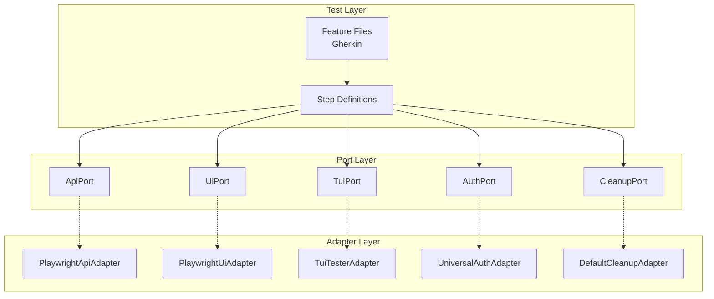

# @kata/stack-tests Documentation

A comprehensive BDD testing framework built on Playwright, providing reusable fixtures, adapters, and step definitions for API, UI, TUI, and hybrid testing.

## Quick Navigation

### Getting Started
- [Installation](./getting-started/installation.md) - Setup and requirements
- [Quick Start](./getting-started/quick-start.md) - Your first test in 5 minutes
- [Project Setup](./getting-started/project-setup.md) - Playwright configuration

### Core Concepts
- [Architecture](./concepts/architecture.md) - Ports & adapters pattern
- [World State](./concepts/world-state.md) - Variables, headers, cleanup
- [Test Lifecycle](./concepts/test-lifecycle.md) - Fixtures, hooks, teardown
- [Tag System](./concepts/tag-system.md) - @api, @ui, @tui, @hybrid

### Guides
- [API Testing](./guides/api-testing.md) - HTTP API testing
- [UI Testing](./guides/ui-testing.md) - Browser automation
- [TUI Testing](./guides/tui-testing.md) - Terminal UI testing
- [Hybrid Testing](./guides/hybrid-testing.md) - Cross-layer tests
- [Custom Adapters](./guides/custom-adapters.md) - Extend the framework
- [Custom Steps](./guides/custom-steps.md) - Domain-specific steps
- [CI/CD Integration](./guides/ci-cd.md) - GitHub Actions, pipelines

### Reference
#### API Reference
- [Ports](./reference/api/ports.md) - Interface definitions
- [Adapters](./reference/api/adapters.md) - Implementation classes
- [Fixtures](./reference/api/fixtures.md) - createBddTest options
- [Utilities](./reference/api/utilities.md) - Helper functions
- [Configuration](./reference/api/configuration.md) - Environment variables

#### Step Reference
- [API Steps](./reference/steps/api-steps.md) - @api tagged steps
- [UI Steps](./reference/steps/ui-steps.md) - @ui tagged steps
- [TUI Steps](./reference/steps/tui-steps.md) - @tui tagged steps
- [Hybrid Steps](./reference/steps/hybrid-steps.md) - @hybrid tagged steps
- [Shared Steps](./reference/steps/shared-steps.md) - Variables & cleanup

### Contributing
- [Contributing Guide](./contributing/CONTRIBUTING.md) - How to contribute
- [Development Setup](./contributing/development-setup.md) - Local environment
- [Coding Standards](./contributing/coding-standards.md) - Style guide
- [Testing](./contributing/testing.md) - Testing the framework
- [Adding Ports](./contributing/adding-ports.md) - Create new ports
- [Adding Adapters](./contributing/adding-adapters.md) - Create new adapters
- [Adding Steps](./contributing/adding-steps.md) - Create step definitions
- [Release Process](./contributing/release-process.md) - Versioning & publishing

### Examples
- [Runnable Examples](../examples/README.md) - Working test projects

---

## Architecture Overview



## Key Features

| Feature | Description |
|---------|-------------|
| **Ports & Adapters** | Clean separation of interfaces and implementations |
| **Multi-Layer Testing** | API, Browser UI, Terminal UI in one framework |
| **BDD Support** | Cucumber/Gherkin syntax via playwright-bdd |
| **Auto Cleanup** | Resources cleaned up automatically after tests |
| **Variable Interpolation** | `{varName}` syntax in step parameters |
| **Tag Filtering** | Run specific test types with @api, @ui, @tui tags |

## Quick Example

```gherkin
@api
Feature: User Management API

  Scenario: Create and verify user
    Given I am authenticated as an admin via API
    When I POST "/admin/users" with JSON body:
      """
      { "email": "test@example.com", "name": "Test User" }
      """
    Then the response status should be 201
    And I store the value at "id" as "userId"
    
    When I GET "/admin/users/{userId}"
    Then the response status should be 200
    And the value at "email" should equal "test@example.com"
```

## License

See [LICENSE](../LICENSE) in the root of the repository.
