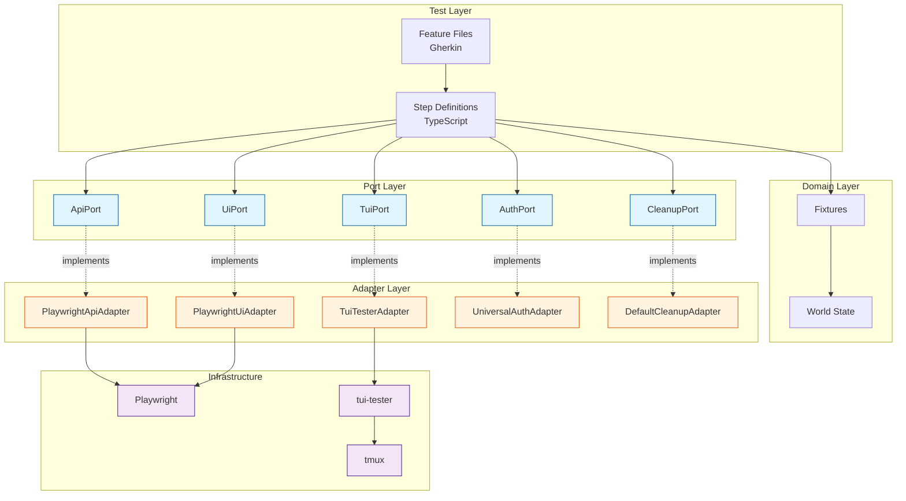
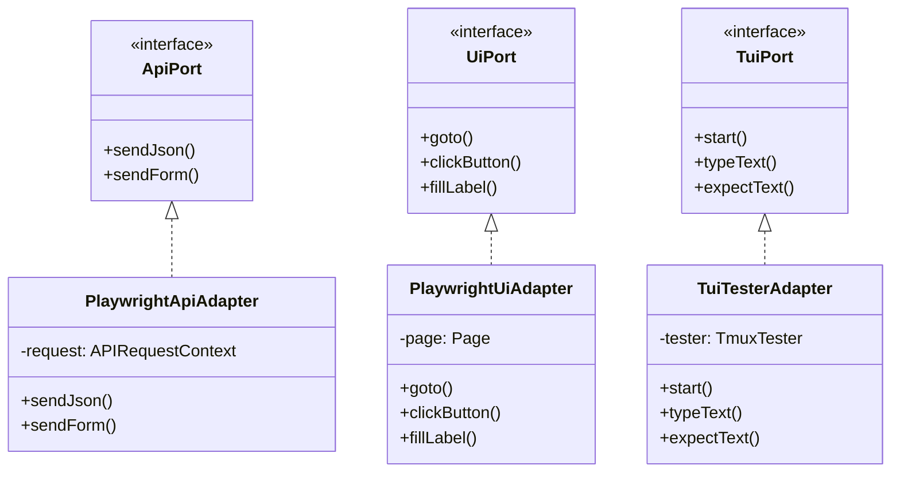
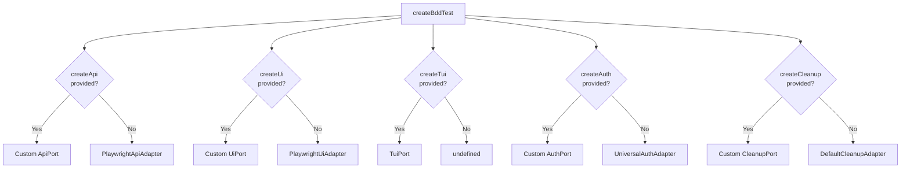

# Architecture

@kata/stack-tests is built on the **Ports and Adapters** (Hexagonal) architecture pattern, enabling clean separation of concerns and easy extensibility.

## Overview



## Why Ports and Adapters?

### The Problem

Traditional test frameworks tightly couple test logic to implementation details:

```typescript
// Tightly coupled - hard to change, hard to test
test('create user', async ({ request }) => {
  const response = await request.post('/users', { data: { name: 'Test' } });
  expect(response.status()).toBe(201);
});
```

### The Solution

Ports and Adapters separates **what** from **how**:

```typescript
// Port defines WHAT (interface)
interface ApiPort {
  sendJson(method: string, path: string, body?: unknown): Promise<ApiResult>;
}

// Adapter defines HOW (implementation)
class PlaywrightApiAdapter implements ApiPort {
  constructor(private request: APIRequestContext) {}
  
  async sendJson(method, path, body) {
    // Playwright-specific implementation
  }
}

// Steps use the port, not the implementation
When('I POST {string} with JSON body:', async ({ api }, path, body) => {
  await api.sendJson('POST', path, JSON.parse(body));
});
```

### Benefits

| Benefit | Description |
|---------|-------------|
| **Testability** | Mock ports for unit testing step logic |
| **Flexibility** | Swap implementations without changing tests |
| **Clarity** | Clear boundaries between layers |
| **Reusability** | Same steps work with different adapters |

## Ports (Interfaces)

Ports define the contracts that adapters must implement.

### ApiPort

Handles HTTP API interactions:

```typescript
interface ApiPort {
  sendJson(
    method: ApiMethod,
    path: string,
    body?: unknown,
    headers?: Record<string, string>
  ): Promise<ApiResult>;
  
  sendForm(
    method: 'POST' | 'PUT' | 'PATCH',
    path: string,
    form: Record<string, string>,
    headers?: Record<string, string>
  ): Promise<ApiResult>;
}
```

### UiPort

Handles browser UI interactions:

```typescript
interface UiPort {
  goto(path: string): Promise<void>;
  clickButton(name: string): Promise<void>;
  fillLabel(label: string, value: string): Promise<void>;
  expectText(text: string): Promise<void>;
  // ... more methods
}
```

### TuiPort

Handles terminal UI interactions:

```typescript
interface TuiPort {
  start(): Promise<void>;
  stop(): Promise<void>;
  typeText(text: string): Promise<void>;
  pressKey(key: string): Promise<void>;
  expectText(text: string): Promise<void>;
  // ... more methods
}
```

### AuthPort

Handles authentication across layers:

```typescript
interface AuthPort {
  apiLoginAsAdmin(world: World): Promise<void>;
  apiLoginAsUser(world: World): Promise<void>;
  uiLoginAsAdmin(world: World): Promise<void>;
  uiLoginAsUser(world: World): Promise<void>;
}
```

### CleanupPort

Handles resource cleanup:

```typescript
interface CleanupPort {
  registerFromVar(world: World, varName: string, id: unknown): void;
}
```

## Adapters (Implementations)

Adapters implement ports using specific technologies.

### Built-in Adapters



### Custom Adapters

You can create custom adapters for different implementations:

```typescript
// Example: Axios-based API adapter
class AxiosApiAdapter implements ApiPort {
  constructor(private client: AxiosInstance) {}
  
  async sendJson(method, path, body, headers) {
    const response = await this.client.request({
      method,
      url: path,
      data: body,
      headers,
    });
    return {
      status: response.status,
      json: response.data,
      // ...
    };
  }
}
```

## Dependency Injection

The `createBddTest` function wires everything together:



### Configuration Example

```typescript
import { createBddTest } from '@kata/stack-tests';

// Use all defaults
const test = createBddTest();

// Customize specific adapters
const test = createBddTest({
  createApi: ({ apiRequest }) => new CustomApiAdapter(apiRequest),
  createCleanup: () => new CustomCleanupAdapter({ rules: myRules }),
});
```

## Layer Responsibilities

### Test Layer
- Feature files (Gherkin)
- Step definitions
- Test configuration

### Domain Layer
- World state management
- Variable interpolation
- Test lifecycle

### Port Layer
- Interface definitions
- Contracts between layers
- No implementation details

### Adapter Layer
- Technology-specific implementations
- Infrastructure integration
- Error handling

### Infrastructure Layer
- Playwright (browser/HTTP)
- tui-tester/tmux (terminal)
- External services

## Extending the Architecture

### Adding a New Port

1. Define the interface in `ports/`
2. Create adapter in `adapters/`
3. Add to fixtures
4. Create step definitions

See [Adding Ports](../contributing/adding-ports.md) for details.

### Adding a New Adapter

1. Implement existing port interface
2. Register in `createBddTest` options

See [Adding Adapters](../contributing/adding-adapters.md) for details.

## Related Topics

- [World State](./world-state.md) - State management
- [Test Lifecycle](./test-lifecycle.md) - Fixture flow
- [Custom Adapters Guide](../guides/custom-adapters.md) - Practical examples
