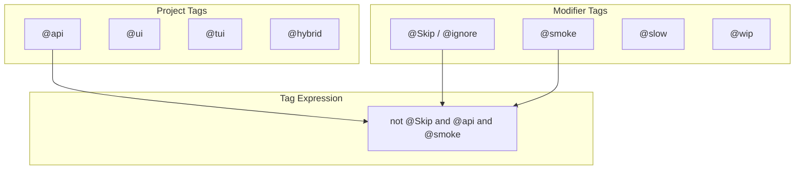

# Tag System

Tags organize tests and control which steps and scenarios execute.

## Overview



## Project Tags

Project tags determine which test suite a scenario belongs to:

| Tag | Description | Steps Available |
|-----|-------------|-----------------|
| `@api` | HTTP API tests | API auth, HTTP, assertions |
| `@ui` | Browser UI tests | Navigation, forms, assertions |
| `@tui` | Terminal UI tests | TUI input, output, snapshots |
| `@hybrid` | Cross-layer tests | All step types |

### Usage

```gherkin
@api
Feature: User API
  # All scenarios use API steps

@ui
Feature: Login Page
  # All scenarios use UI steps

@tui
Feature: CLI Application
  # All scenarios use TUI steps

@hybrid
Feature: End-to-End Flow
  # Scenarios can mix API and UI steps
```

## Modifier Tags

Modifier tags add metadata or control execution:

### Built-in Modifiers

| Tag | Description |
|-----|-------------|
| `@Skip` | Skip this scenario |
| `@ignore` | Skip this scenario (alias) |
| `@wip` | Work in progress |
| `@smoke` | Quick smoke test |
| `@slow` | Long-running test |
| `@critical` | Critical path test |
| `@external` | Requires external service |

### Custom Modifiers

Define your own:

```gherkin
@api @regression
Scenario: Complex user workflow
  ...

@ui @visual
Scenario: Check page layout
  ...
```

## Tag Expressions

Tag expressions filter which tests run.

### Operators

| Operator | Example | Description |
|----------|---------|-------------|
| `and` | `@api and @smoke` | Both tags required |
| `or` | `@smoke or @critical` | Either tag |
| `not` | `not @Skip` | Tag absent |
| `()` | `(@smoke or @critical)` | Grouping |

### Examples

```bash
# Run only API smoke tests
--grep "@api and @smoke"

# Run smoke or critical tests
--grep "@smoke or @critical"

# Exclude slow tests
--grep "not @slow"

# Complex expression
--grep "@api and (@smoke or @critical) and not @external"
```

## Configuration Helpers

### tagsForProject

Builds tag expressions with default excludes:

```typescript
import { tagsForProject } from '@kata/stack-tests';

// Basic - adds default excludes
tagsForProject({ projectTag: '@api' })
// Result: "not @Skip and not @ignore and @api"

// With extra tags
tagsForProject({ projectTag: '@api', extraTags: '@smoke' })
// Result: "not @Skip and not @ignore and @api and (@smoke)"

// Custom excludes
tagsForProject({ 
  projectTag: '@api', 
  defaultExcludes: 'not @Skip and not @wip' 
})
// Result: "not @Skip and not @wip and @api"
```

### resolveExtraTags

Normalizes tag input from environment or CLI:

```typescript
import { resolveExtraTags } from '@kata/stack-tests';

// Tag expression (passed through)
resolveExtraTags('@smoke or @critical')
// Result: "@smoke or @critical"

// Comma-separated (converted to OR)
resolveExtraTags('smoke,critical')
// Result: "@smoke or @critical"

// Single tag
resolveExtraTags('smoke')
// Result: "@smoke"

// Empty/null
resolveExtraTags('')
// Result: undefined
```

## Project Configuration

### Playwright Config

```typescript
// playwright.config.ts
import { defineBddProject } from 'playwright-bdd';
import { tagsForProject, resolveExtraTags } from '@kata/stack-tests';

const extraTags = resolveExtraTags(process.env.TEST_TAGS);

const apiBdd = defineBddProject({
  name: 'api',
  features: 'features/api/**/*.feature',
  steps: 'features/steps/**/*.ts',
  tags: tagsForProject({ projectTag: '@api', extraTags }),
});

const uiBdd = defineBddProject({
  name: 'ui',
  features: 'features/ui/**/*.feature',
  steps: 'features/steps/**/*.ts',
  tags: tagsForProject({ projectTag: '@ui', extraTags }),
});
```

### Running with Tags

```bash
# Via environment variable
TEST_TAGS=@smoke npm test

# Via Playwright grep
npx playwright test --grep "@smoke"

# Specific project
npx playwright test --project=api

# Combined
TEST_TAGS=@critical npx playwright test --project=api
```

## Step-Level Tags

Steps are also tagged to ensure they only run in appropriate contexts:

```typescript
// Only available in @api scenarios
When('I GET {string}', { tags: '@api' }, async ({ api }, path) => {
  // ...
});

// Only available in @ui scenarios
When('I click the button {string}', { tags: '@ui' }, async ({ ui }, name) => {
  // ...
});

// Only available in @tui scenarios
When('I type {string}', { tags: '@tui' }, async ({ tui }, text) => {
  // ...
});

// Available everywhere (no tag)
Given('I set variable {string} to {string}', async ({ world }, name, value) => {
  // ...
});
```

## Tag Inheritance

### Feature-Level Tags

Tags on the feature apply to all scenarios:

```gherkin
@api @smoke
Feature: Quick API Tests
  # Both @api and @smoke apply to all scenarios

  Scenario: Health check
    # Inherits @api and @smoke
    When I GET "/health"

  Scenario: Version check
    # Inherits @api and @smoke
    When I GET "/version"
```

### Scenario-Level Tags

Tags on scenarios add to (not replace) feature tags:

```gherkin
@api
Feature: User API

  @smoke
  Scenario: Quick health check
    # Tags: @api, @smoke
    When I GET "/health"

  @slow @external
  Scenario: Integration test
    # Tags: @api, @slow, @external
    When I POST "/external-sync" ...
```

### Rule-Level Tags

Tags on Rules apply to scenarios within:

```gherkin
@api
Feature: User API

  @admin
  Rule: Admin operations

    Scenario: Create user
      # Tags: @api, @admin
      ...

    Scenario: Delete user
      # Tags: @api, @admin
      ...

  @member
  Rule: Member operations

    Scenario: View profile
      # Tags: @api, @member
      ...
```

## Common Patterns

### Smoke Test Suite

```gherkin
# features/api/health.feature
@api @smoke
Feature: API Health Checks

  Scenario: Health endpoint
    When I GET "/health"
    Then the response status should be 200

# features/ui/login.feature  
@ui @smoke
Feature: Login Smoke Test

  Scenario: Page loads
    Given I navigate to "/login"
    Then I should see text "Sign In"
```

```bash
# Run all smoke tests
TEST_TAGS=@smoke npm test
```

### Skip Work in Progress

```gherkin
@api
Feature: New Feature

  @wip
  Scenario: Not ready yet
    # Skipped by default tag expression
    ...

  Scenario: Working test
    # Runs normally
    ...
```

### External Dependencies

```gherkin
@api
Feature: External Integration

  @external
  Scenario: Call third-party API
    # Tag allows filtering when service unavailable
    When I POST "/external-webhook" ...
```

```bash
# Skip external tests
npx playwright test --grep "not @external"
```

## Best Practices

### Consistent Tagging

```gherkin
# Good - clear categorization
@api @smoke @auth
Scenario: Login returns token

# Avoid - inconsistent
@API @Smoke @AUTH  # Case inconsistency
```

### Minimal Tags

```gherkin
# Good - necessary tags only
@api @critical
Scenario: Payment processing

# Avoid - over-tagging
@api @critical @payment @backend @integration @v2
Scenario: Payment processing
```

### Document Custom Tags

```markdown
## Project Tags

| Tag | Description | Owner |
|-----|-------------|-------|
| @payments | Payment service tests | payments-team |
| @legacy | Legacy API tests | platform-team |
```

## Related Topics

- [Project Setup](../getting-started/project-setup.md) - Playwright config
- [API Steps Reference](../reference/steps/api-steps.md) - @api steps
- [UI Steps Reference](../reference/steps/ui-steps.md) - @ui steps
