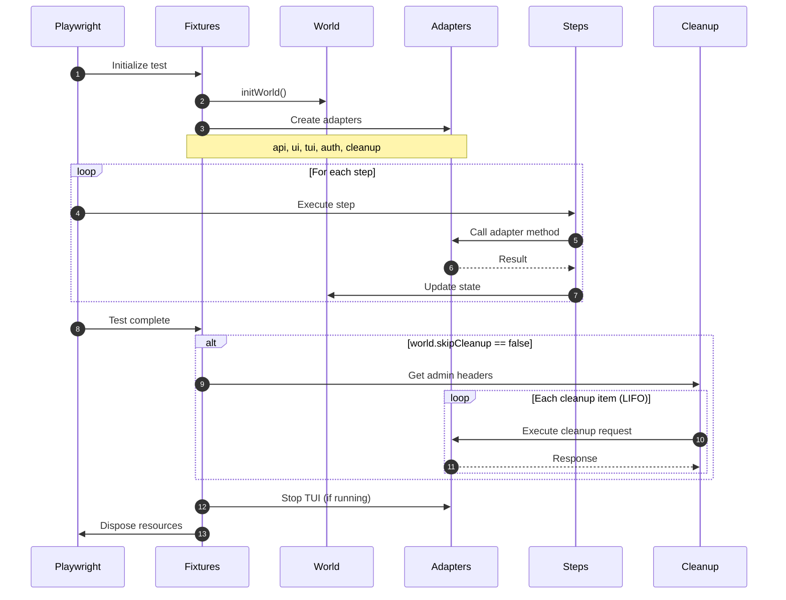
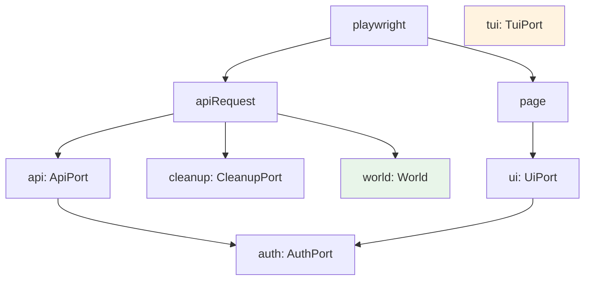
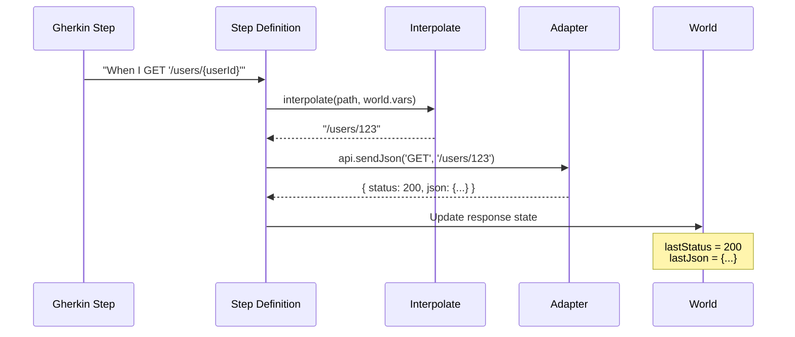
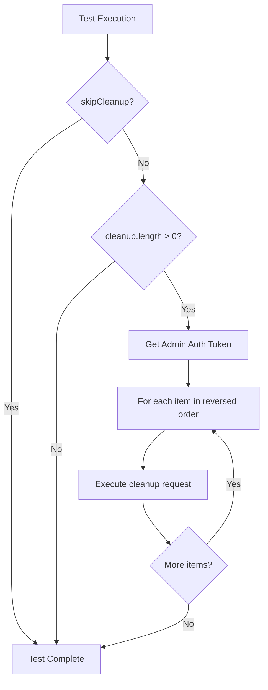
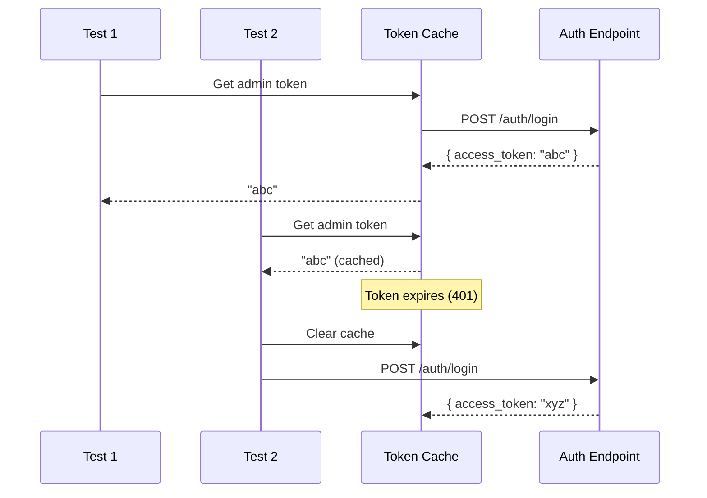
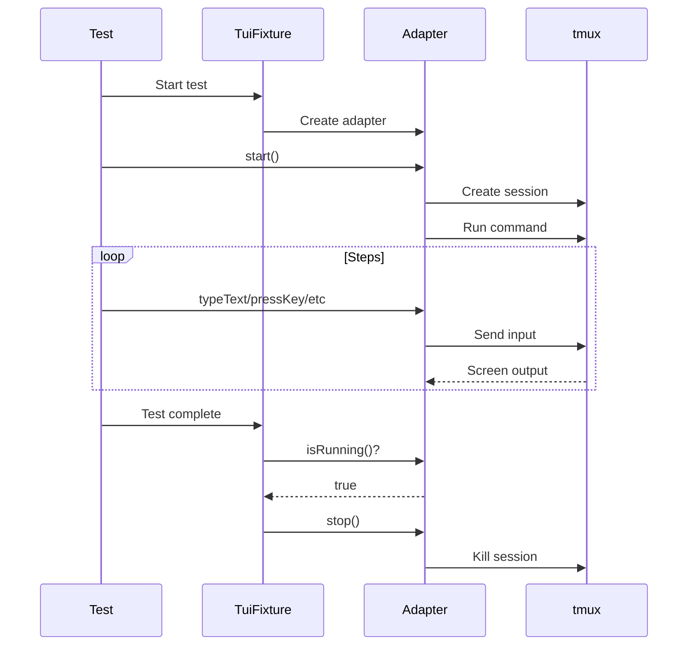
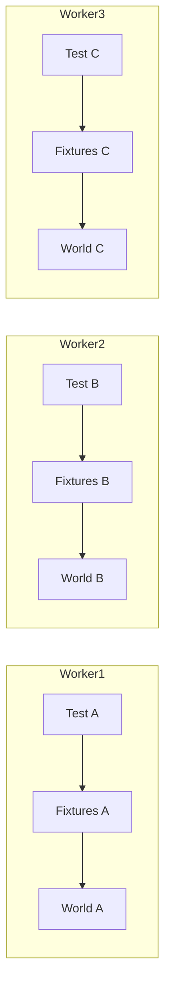

# Test Lifecycle

Understanding when fixtures are created, how steps execute, and when cleanup occurs.

## Overview



## Fixture Initialization

### Dependency Chain

Fixtures are created in dependency order:



### Fixture Creation Code

```typescript
// Simplified fixture creation flow
return base.extend({
  // 1. API request context
  apiRequest: async ({ playwright }, use) => {
    const ctx = await playwright.request.newContext({ baseURL });
    await use(ctx);
    await ctx.dispose();
  },

  // 2. API adapter (depends on apiRequest)
  api: async ({ apiRequest }, use) => {
    await use(createApi({ apiRequest }));
  },

  // 3. UI adapter (depends on page)
  ui: async ({ page }, use) => {
    await use(createUi({ page }));
  },

  // 4. Auth adapter (depends on api and ui)
  auth: async ({ api, ui }, use) => {
    await use(createAuth({ api, ui }));
  },

  // 5. World (with cleanup teardown)
  world: async ({ apiRequest }, use) => {
    const world = worldFactory();
    await use(world);
    // Cleanup runs here after test
  },

  // 6. TUI (independent, optional)
  tui: async ({}, use) => {
    const tuiAdapter = createTui?.();
    await use(tuiAdapter);
    if (tuiAdapter?.isRunning()) {
      await tuiAdapter.stop();
    }
  },
});
```

## Step Execution

### Step Flow



### Step Definition Structure

```typescript
When('I GET {string}', { tags: '@api' }, async ({ api, world }, path) => {
  // 1. Interpolate variables
  const resolvedPath = interpolate(path, world.vars);
  
  // 2. Execute via adapter
  const result = await api.sendJson('GET', resolvedPath, undefined, world.headers);
  
  // 3. Update world state
  world.lastResponse = result.response;
  world.lastStatus = result.status;
  world.lastJson = result.json;
  world.lastText = result.text;
  world.lastHeaders = result.headers;
  world.lastContentType = result.contentType;
});
```

## Cleanup Phase

### When Cleanup Runs

Cleanup executes **after** the test completes, regardless of pass/fail:



### Cleanup Execution

```typescript
// In world fixture teardown
if (!world.skipCleanup && world.cleanup.length > 0) {
  for (const item of [...world.cleanup].reverse()) {
    const adminHeaders = await getAdminHeaders(apiRequest);
    const headers = { ...adminHeaders, ...(item.headers || {}) };
    
    try {
      const resp = await apiRequest.fetch(item.path, {
        method: item.method,
        headers,
      });
      
      const status = resp.status();
      if (status === 401 || status === 403) {
        // Token expired, clear cache
        cachedAdminToken = undefined;
      }
      if (status >= 400 && status !== 404) {
        console.warn(`cleanup ${item.method} ${item.path} failed`, status);
      }
    } catch (err) {
      console.warn('cleanup error', item.method, item.path, err);
    }
  }
}
```

### Admin Token Caching

For efficiency, admin tokens are cached across tests:



## TUI Lifecycle

TUI adapters have their own lifecycle:



## Error Handling

### Step Errors

When a step fails:

1. Error is thrown
2. Remaining steps in scenario are skipped
3. Cleanup still runs
4. Error is reported

### Cleanup Errors

Cleanup errors are **logged but not thrown**:

```typescript
try {
  await apiRequest.fetch(item.path, { method: item.method });
} catch (err) {
  console.warn('cleanup error', err);
  // Continue with next cleanup item
}
```

This ensures:
- All cleanup items are attempted
- One failure doesn't prevent others
- Test result reflects actual test failure, not cleanup

### TUI Cleanup Errors

```typescript
if (tuiAdapter?.isRunning()) {
  try {
    await tuiAdapter.stop();
  } catch (error) {
    console.warn('Error stopping TUI adapter:', error);
  }
}
```

## Hooks and Timeouts

### Playwright Timeouts

```typescript
// playwright.config.ts
export default defineConfig({
  timeout: 60_000,        // Test timeout
  expect: {
    timeout: 10_000,      // Assertion timeout
  },
});
```

### Background Steps

Background steps run **before each scenario**:

```gherkin
Feature: User API

  Background:
    Given I am authenticated as an admin via API
    # Runs before every scenario

  Scenario: Create user
    When I POST "/users" ...

  Scenario: List users
    When I GET "/users" ...
```

### Scenario Outline

Each example row is a separate test with its own lifecycle:

```gherkin
Scenario Outline: Create <role> user
  When I POST "/users" with JSON body:
    """
    { "role": "<role>" }
    """
  Then the response status should be 201

  Examples:
    | role   |
    | admin  |  # Test 1: full lifecycle
    | member |  # Test 2: full lifecycle
    | guest  |  # Test 3: full lifecycle
```

## Parallel Execution

Each worker gets isolated fixtures:



Configure parallelism:

```typescript
// playwright.config.ts
export default defineConfig({
  fullyParallel: true,
  workers: process.env.CI ? 1 : undefined,
});
```

## Best Practices

### Cleanup Registration

Register cleanup **immediately** after creating resources:

```gherkin
# Good
When I POST "/users" with JSON body: ...
Then I store the value at "id" as "userId"
Given I register cleanup DELETE "/users/{userId}"

# Or use auto-cleanup via DefaultCleanupAdapter
```

### Avoid State Leakage

Each scenario should be independent:

```gherkin
# Good - self-contained
Scenario: Create and delete user
  Given I am authenticated as admin
  When I POST "/users" ...
  Then I store the value at "id" as "userId"
  When I DELETE "/users/{userId}"
  Then the response status should be 204

# Avoid - depending on other scenarios
Scenario: Use user from previous test
  When I GET "/users/{userId}"  # userId from where?
```

### Debug Lifecycle Issues

```gherkin
# Disable cleanup to inspect state
Given I disable cleanup

# Print world state (custom step)
Then I debug the world state
```

## Related Topics

- [World State](./world-state.md) - State management details
- [Architecture](./architecture.md) - System structure
- [API Steps Reference](../reference/steps/api-steps.md) - HTTP step details
