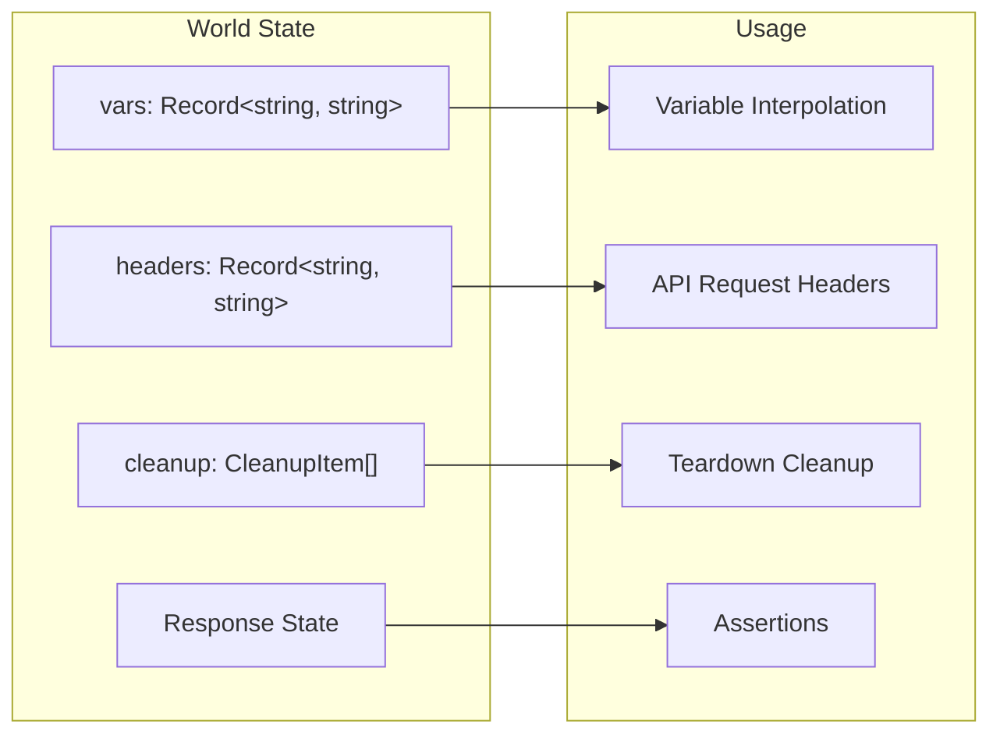
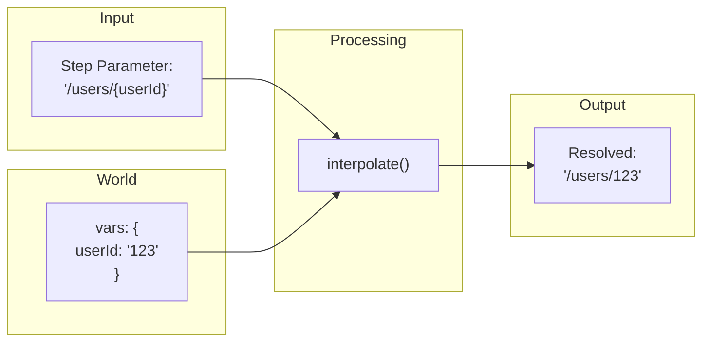
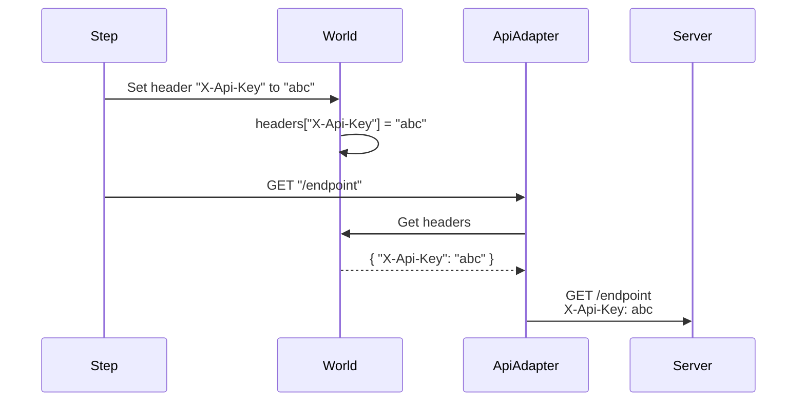
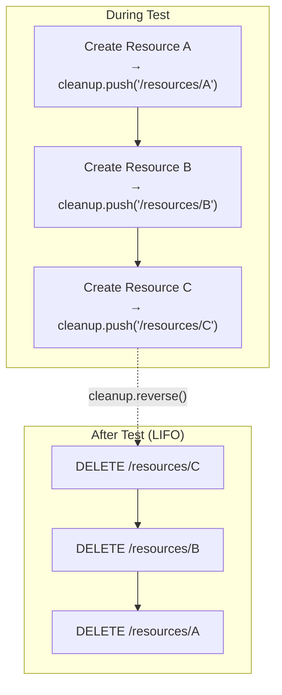
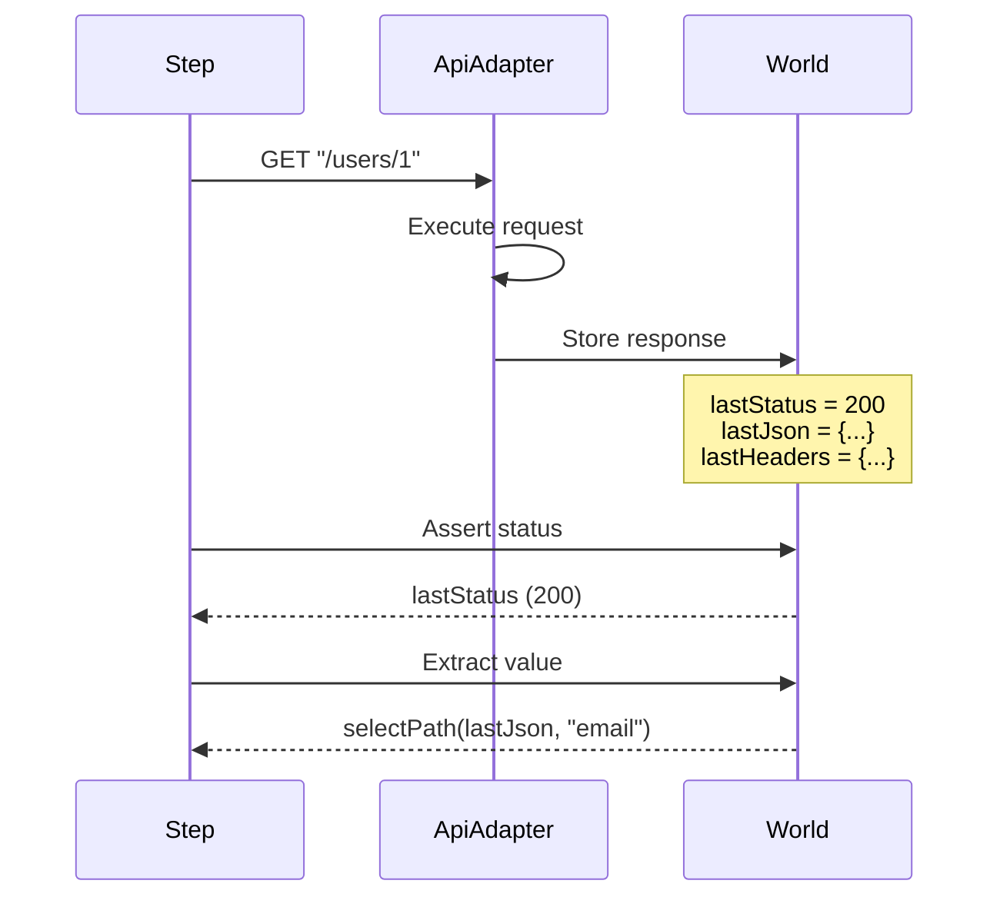

# World State

The World is the central state container for each test, managing variables, headers, cleanup items, and response data.

## Overview



## World Type Definition

```typescript
type World = {
  // Variables for interpolation
  vars: Record<string, string>;
  
  // Headers sent with API requests
  headers: Record<string, string>;
  
  // Items to cleanup after test
  cleanup: CleanupItem[];
  
  // Skip cleanup after test
  skipCleanup?: boolean;
  
  // Last API response data
  lastResponse?: APIResponse;
  lastStatus?: number;
  lastText?: string;
  lastJson?: unknown;
  lastHeaders?: Record<string, string>;
  lastContentType?: string;
};

type CleanupItem = {
  method: 'DELETE' | 'POST' | 'PATCH' | 'PUT';
  path: string;
  headers?: Record<string, string>;
};
```

## Variables (vars)

Variables store dynamic values that can be interpolated into step parameters.

### Setting Variables

```gherkin
# Direct assignment
Given I set variable "userId" to "123"

# From UUID generation
Given I generate a UUID and store as "uniqueId"

# From API response
When I GET "/users/1"
Then I store the value at "id" as "userId"
And I store the value at "profile.name" as "userName"
```

### Using Variables

Variables are interpolated using `{varName}` syntax:

```gherkin
# In paths
When I GET "/users/{userId}"

# In request bodies
When I POST "/users" with JSON body:
  """
  {
    "email": "{email}",
    "name": "{userName}"
  }
  """

# In assertions
Then the value at "id" should equal "{userId}"
```

### Interpolation Flow



### Nested Variable Access

When storing from JSON responses:

```gherkin
# Response: { "data": { "user": { "id": 42 } } }
Then I store the value at "data.user.id" as "userId"

# Response: { "items": [{ "id": 1 }, { "id": 2 }] }
Then I store the value at "items[0].id" as "firstItemId"
```

## Headers

Headers are automatically included in API requests.

### Setting Headers

```gherkin
# Manual header
Given I set header "X-Custom-Header" to "value"

# Authentication sets Authorization header
Given I am authenticated as an admin via API
# Sets: Authorization: Bearer <token>
```

### Header Lifecycle



## Cleanup Queue

Resources created during tests are tracked for automatic cleanup.

### Registering Cleanup

```gherkin
# Manual registration
Given I register cleanup DELETE "/users/{userId}"

# Automatic from DefaultCleanupAdapter
When I POST "/users" with JSON body:
  """
  { "email": "test@example.com" }
  """
Then I store the value at "id" as "userId"
# If using heuristic cleanup, auto-registered based on variable name
```

### Cleanup Flow



### Why LIFO Order?

Resources often have dependencies:

```gherkin
# Create team first
When I POST "/teams" with JSON body: { "name": "Team A" }
Then I store the value at "id" as "teamId"

# Then add user to team
When I POST "/teams/{teamId}/members" with JSON body: { "userId": "123" }
Then I store the value at "id" as "memberId"
```

Cleanup order: member → team (can't delete team with members)

### Skipping Cleanup

```gherkin
# Disable for debugging
Given I disable cleanup
```

Or via world state:
```typescript
world.skipCleanup = true;
```

## Response State

API responses are stored for assertions and extraction.

### Available Properties

| Property | Type | Description |
|----------|------|-------------|
| `lastResponse` | `APIResponse` | Full Playwright response |
| `lastStatus` | `number` | HTTP status code |
| `lastText` | `string` | Response body as text |
| `lastJson` | `unknown` | Parsed JSON body |
| `lastHeaders` | `Record<string, string>` | Response headers |
| `lastContentType` | `string` | Content-Type header |

### Response Flow



### Using Response Data

```gherkin
When I GET "/users/1"
Then the response status should be 200
And the response should be a JSON object
And the value at "email" should equal "user@example.com"
And I store the value at "id" as "userId"
```

## World Initialization

Each test gets a fresh world:

```typescript
function initWorld(): World {
  return {
    vars: {},
    headers: {},
    cleanup: [],
  };
}
```

## Custom World

Extend the world for domain-specific state:

```typescript
import { World, initWorld, createBddTest } from '@kata/stack-tests';

interface MyWorld extends World {
  currentUser?: { id: string; email: string };
  featureFlags: Record<string, boolean>;
}

function initMyWorld(): MyWorld {
  return {
    ...initWorld(),
    featureFlags: {},
  };
}

const test = createBddTest({
  worldFactory: initMyWorld,
});
```

## Best Practices

### Variable Naming

```gherkin
# Good - descriptive names
Given I store the value at "id" as "createdUserId"
Given I store the value at "token" as "adminAccessToken"

# Avoid - ambiguous names
Given I store the value at "id" as "id"
Given I store the value at "token" as "t"
```

### Cleanup Reliability

```gherkin
# Good - explicit cleanup registration
Given I register cleanup DELETE "/users/{userId}"

# Better - use cleanup adapter with rules
# (automatic based on variable patterns)
```

### Header Management

```gherkin
# Good - authenticate once per scenario
Background:
  Given I am authenticated as an admin via API

# Avoid - authenticating in every step
```

## Related Topics

- [Test Lifecycle](./test-lifecycle.md) - When world is created/destroyed
- [Architecture](./architecture.md) - How world fits in the system
- [Shared Steps Reference](../reference/steps/shared-steps.md) - Variable steps
