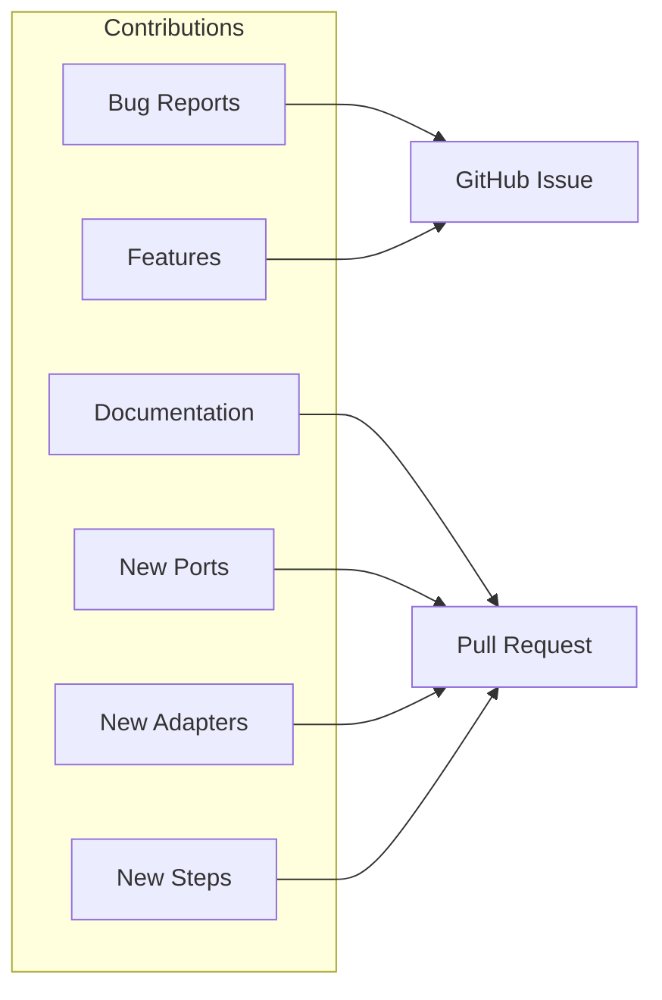
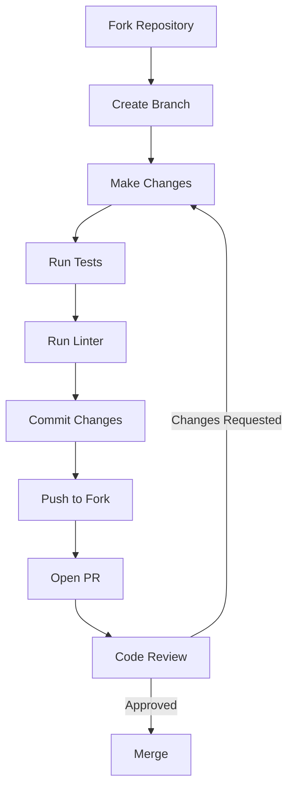

# Contributing to @kata/stack-tests

Welcome! We appreciate your interest in contributing to the @kata/stack-tests BDD testing framework.

## Code of Conduct

Be respectful, inclusive, and constructive. We're all here to build better testing tools.

## Ways to Contribute



### Bug Reports

1. Search existing issues first
2. Use the bug report template
3. Include:
   - Framework version
   - Playwright version
   - Minimal reproduction
   - Expected vs actual behavior

### Feature Requests

1. Open a GitHub issue with `[Feature]` prefix
2. Describe the use case
3. Explain why existing features don't solve it
4. Suggest an implementation approach

### Pull Requests

1. Fork the repository
2. Create a feature branch from `main`
3. Follow coding standards
4. Add tests for new functionality
5. Update documentation
6. Submit PR against `main`

## Pull Request Process



### Branch Naming

```
feat/add-graphql-port       # New feature
fix/api-timeout-handling    # Bug fix
docs/update-api-guide       # Documentation
refactor/cleanup-adapters   # Refactoring
test/add-tui-unit-tests     # Tests only
```

### Commit Messages

Follow [Conventional Commits](https://www.conventionalcommits.org/):

```bash
# Format
<type>(<scope>): <description>

# Examples
feat(api): add retry logic for transient failures
fix(ui): resolve flaky selector timeout
docs(tui): add wizard testing guide
refactor(ports): extract common validation logic
test(adapters): add unit tests for auth adapter
```

Types: `feat`, `fix`, `docs`, `refactor`, `test`, `chore`, `perf`

### PR Checklist

- [ ] Code follows project style guidelines
- [ ] Tests pass locally (`npm test`)
- [ ] Linter passes (`npm run lint`)
- [ ] New features have tests
- [ ] Documentation updated if needed
- [ ] Commit messages follow convention
- [ ] PR description explains the change

## Review Process

1. **Automated Checks**: CI runs tests and linting
2. **Code Review**: Maintainer reviews within 3 business days
3. **Feedback**: Address any requested changes
4. **Approval**: Requires 1 maintainer approval
5. **Merge**: Squash and merge to `main`

## Development Workflow

### Quick Start

```bash
# Clone and setup
git clone https://github.com/kata/stack-tests.git
cd stack-tests
npm install

# Create branch
git checkout -b feat/my-feature

# Make changes and test
npm run build
npm test

# Commit and push
git add .
git commit -m "feat(scope): description"
git push origin feat/my-feature
```

### Running Specific Tests

```bash
# Run all tests
npm test

# Run specific test file
npm test -- --grep "ApiPort"

# Run with verbose output
npm test -- --verbose
```

## Getting Help

- **Questions**: Open a GitHub Discussion
- **Bugs**: Open a GitHub Issue
- **Chat**: Join our Discord (link in README)

## Recognition

Contributors are recognized in:
- CHANGELOG.md for each release
- GitHub release notes
- README contributors section

## Related Guides

- [Development Setup](./development-setup.md) - Detailed setup instructions
- [Coding Standards](./coding-standards.md) - Style guidelines
- [Testing](./testing.md) - Testing the framework
- [Adding Ports](./adding-ports.md) - Create new ports
- [Adding Adapters](./adding-adapters.md) - Create new adapters
- [Adding Steps](./adding-steps.md) - Create step definitions
- [Release Process](./release-process.md) - How releases work
