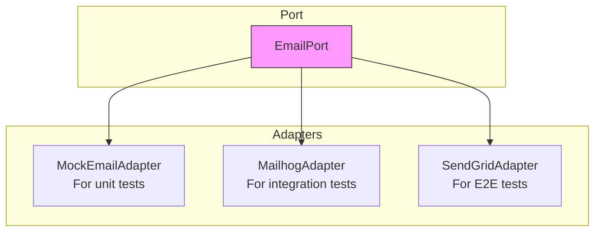

# Adding New Adapters

Guide to implementing adapter classes for @kata/stack-tests ports.

## Overview

Adapters implement port interfaces, providing the actual integration with tools, libraries, and services.



## When to Create an Adapter

Create a new adapter when:
- Implementing a port for the first time
- Supporting a new backend/service for existing port
- Creating test doubles (mocks, stubs)
- Targeting different environments

## Adapter Design Principles

### 1. Full Interface Implementation

```typescript
// Must implement ALL port methods
export class MailhogAdapter implements EmailPort {
  async sendEmail(to: string, subject: string, body: string): Promise<void> {
    // Implementation required
  }
  
  async getLastEmail(to: string): Promise<Email | null> {
    // Implementation required
  }
  
  async waitForEmail(to: string, options?: WaitOptions): Promise<Email> {
    // Implementation required
  }
  
  async clearEmails(): Promise<void> {
    // Implementation required
  }
}
```

### 2. Constructor Injection

```typescript
// Good - dependencies injected via constructor
export class MailhogAdapter implements EmailPort {
  constructor(
    private readonly config: MailhogConfig,
    private readonly httpClient?: HttpClient
  ) {}
}

// Avoid - hard-coded dependencies
export class MailhogAdapter implements EmailPort {
  private readonly client = new HttpClient(); // Hard to test
}
```

### 3. Configuration via Options

```typescript
export interface MailhogConfig {
  /** Mailhog API URL */
  apiUrl: string;
  /** Request timeout in ms */
  timeout?: number;
  /** Retry attempts for waitForEmail */
  retries?: number;
}

export class MailhogAdapter implements EmailPort {
  private readonly config: Required<MailhogConfig>;
  
  constructor(config: MailhogConfig) {
    this.config = {
      timeout: 30000,
      retries: 10,
      ...config,
    };
  }
}
```

### 4. Resource Cleanup

```typescript
export class DatabaseAdapter implements DatabasePort {
  private connection?: Connection;
  
  async connect(): Promise<void> {
    this.connection = await createConnection(this.config);
  }
  
  async close(): Promise<void> {
    if (this.connection) {
      await this.connection.close();
      this.connection = undefined;
    }
  }
}
```

## Step-by-Step Guide

### 1. Create Adapter Directory

```bash
mkdir -p src/adapters/email
touch src/adapters/email/mailhog.adapter.ts
touch src/adapters/email/index.ts
```

### 2. Implement the Adapter

```typescript
// src/adapters/email/mailhog.adapter.ts

import type { EmailPort, Email, WaitOptions } from '../../ports/email.port.js';

/**
 * Configuration for Mailhog adapter.
 */
export interface MailhogConfig {
  /** Mailhog API URL (e.g., http://localhost:8025) */
  apiUrl: string;
  /** Request timeout in milliseconds */
  timeout?: number;
  /** Polling interval for waitForEmail */
  pollInterval?: number;
}

/**
 * EmailPort adapter using Mailhog for email capture.
 * 
 * Mailhog is a local email testing tool that captures
 * SMTP messages and provides an API to retrieve them.
 * 
 * @example
 * ```typescript
 * const email = new MailhogAdapter({
 *   apiUrl: 'http://localhost:8025',
 * });
 * 
 * await email.waitForEmail('user@test.com');
 * ```
 * 
 * @see https://github.com/mailhog/MailHog
 */
export class MailhogAdapter implements EmailPort {
  private readonly apiUrl: string;
  private readonly timeout: number;
  private readonly pollInterval: number;

  constructor(config: MailhogConfig) {
    this.apiUrl = config.apiUrl.replace(/\/$/, '');
    this.timeout = config.timeout ?? 30000;
    this.pollInterval = config.pollInterval ?? 500;
  }

  async sendEmail(to: string, subject: string, body: string): Promise<void> {
    // Mailhog captures SMTP - this would typically be handled
    // by your application's email service. This method is a no-op
    // or could use nodemailer to send via Mailhog SMTP.
    throw new Error(
      'MailhogAdapter.sendEmail() not implemented. ' +
      'Use your application email service to send emails.'
    );
  }

  async getLastEmail(to: string): Promise<Email | null> {
    const response = await fetch(`${this.apiUrl}/api/v2/messages`);
    
    if (!response.ok) {
      throw new Error(`Mailhog API error: ${response.status}`);
    }
    
    const data = await response.json() as MailhogResponse;
    
    // Find emails matching recipient
    const matching = data.items.filter(item => 
      item.To.some(recipient => 
        recipient.Mailbox + '@' + recipient.Domain === to
      )
    );
    
    if (matching.length === 0) {
      return null;
    }
    
    // Return most recent
    const latest = matching[0];
    return this.mapToEmail(latest);
  }

  async waitForEmail(to: string, options?: WaitOptions): Promise<Email> {
    const timeout = options?.timeout ?? this.timeout;
    const startTime = Date.now();
    
    while (Date.now() - startTime < timeout) {
      const email = await this.getLastEmail(to);
      
      if (email) {
        // Check subject filter if provided
        if (options?.subjectContains) {
          if (email.subject.includes(options.subjectContains)) {
            return email;
          }
        } else {
          return email;
        }
      }
      
      await this.sleep(this.pollInterval);
    }
    
    throw new Error(
      `Timeout waiting for email to ${to} after ${timeout}ms`
    );
  }

  async clearEmails(): Promise<void> {
    const response = await fetch(`${this.apiUrl}/api/v1/messages`, {
      method: 'DELETE',
    });
    
    if (!response.ok) {
      throw new Error(`Failed to clear Mailhog messages: ${response.status}`);
    }
  }

  private mapToEmail(item: MailhogMessage): Email {
    const to = item.To[0];
    const from = item.From;
    
    return {
      from: `${from.Mailbox}@${from.Domain}`,
      to: `${to.Mailbox}@${to.Domain}`,
      subject: item.Content.Headers.Subject?.[0] ?? '',
      body: item.Content.Body,
      html: item.Content.Headers['Content-Type']?.[0]?.includes('html')
        ? item.Content.Body
        : undefined,
      receivedAt: new Date(item.Created),
    };
  }

  private sleep(ms: number): Promise<void> {
    return new Promise(resolve => setTimeout(resolve, ms));
  }
}

// Mailhog API types
interface MailhogResponse {
  total: number;
  items: MailhogMessage[];
}

interface MailhogMessage {
  ID: string;
  From: MailhogAddress;
  To: MailhogAddress[];
  Content: {
    Headers: Record<string, string[]>;
    Body: string;
  };
  Created: string;
}

interface MailhogAddress {
  Mailbox: string;
  Domain: string;
}
```

### 3. Create Index Export

```typescript
// src/adapters/email/index.ts

export { MailhogAdapter } from './mailhog.adapter.js';
export type { MailhogConfig } from './mailhog.adapter.js';
```

### 4. Export from Adapters Index

Update `src/adapters/index.ts`:

```typescript
// Existing exports
export * from './api/index.js';
export * from './ui/index.js';
export * from './tui/index.js';
export * from './auth/index.js';
export * from './cleanup/index.js';

// New export
export * from './email/index.js';
```

### 5. Export from Main Index

Update `src/index.ts`:

```typescript
// Adapters
export {
  PlaywrightApiAdapter,
  PlaywrightUiAdapter,
  TuiTesterAdapter,
  DefaultAuthAdapter,
  DefaultCleanupAdapter,
  MailhogAdapter,        // New
} from './adapters/index.js';

export type {
  ApiAdapterConfig,
  UiAdapterConfig,
  TuiAdapterConfig,
  AuthConfig,
  CleanupConfig,
  MailhogConfig,         // New
} from './adapters/index.js';
```

## Creating Mock Adapters

For testing step definitions:

```typescript
// src/adapters/email/mock-email.adapter.ts

import type { EmailPort, Email, WaitOptions } from '../../ports/email.port.js';

/**
 * Mock EmailPort adapter for unit testing.
 * 
 * Stores emails in memory and provides methods to
 * inspect captured emails in tests.
 */
export class MockEmailAdapter implements EmailPort {
  private emails: Email[] = [];
  private sendEmailMock?: (to: string, subject: string, body: string) => void;

  /**
   * Sets a mock function to be called on sendEmail.
   */
  onSendEmail(fn: (to: string, subject: string, body: string) => void): void {
    this.sendEmailMock = fn;
  }

  /**
   * Adds an email to the inbox (for test setup).
   */
  addEmail(email: Email): void {
    this.emails.unshift(email);
  }

  async sendEmail(to: string, subject: string, body: string): Promise<void> {
    const email: Email = {
      from: 'test@example.com',
      to,
      subject,
      body,
      receivedAt: new Date(),
    };
    
    this.emails.unshift(email);
    this.sendEmailMock?.(to, subject, body);
  }

  async getLastEmail(to: string): Promise<Email | null> {
    return this.emails.find(e => e.to === to) ?? null;
  }

  async waitForEmail(to: string, options?: WaitOptions): Promise<Email> {
    const email = await this.getLastEmail(to);
    
    if (!email) {
      throw new Error(`No email found for ${to}`);
    }
    
    if (options?.subjectContains && !email.subject.includes(options.subjectContains)) {
      throw new Error(
        `Email subject "${email.subject}" doesn't contain "${options.subjectContains}"`
      );
    }
    
    return email;
  }

  async clearEmails(): Promise<void> {
    this.emails = [];
  }

  /**
   * Returns all captured emails (for test assertions).
   */
  getAllEmails(): Email[] {
    return [...this.emails];
  }
}
```

## Testing Adapters

### Unit Tests

```typescript
// tests/adapters/mailhog.adapter.test.ts

import { describe, it, expect, beforeEach, vi } from 'vitest';
import { MailhogAdapter } from '../../src/adapters/email/mailhog.adapter.js';

describe('MailhogAdapter', () => {
  let adapter: MailhogAdapter;

  beforeEach(() => {
    adapter = new MailhogAdapter({
      apiUrl: 'http://localhost:8025',
    });
  });

  describe('getLastEmail()', () => {
    it('should return null when no emails exist', async () => {
      vi.spyOn(global, 'fetch').mockResolvedValue({
        ok: true,
        json: () => Promise.resolve({ total: 0, items: [] }),
      } as Response);

      const result = await adapter.getLastEmail('test@example.com');
      
      expect(result).toBeNull();
    });

    it('should return mapped email when found', async () => {
      vi.spyOn(global, 'fetch').mockResolvedValue({
        ok: true,
        json: () => Promise.resolve({
          total: 1,
          items: [{
            ID: '1',
            From: { Mailbox: 'sender', Domain: 'example.com' },
            To: [{ Mailbox: 'test', Domain: 'example.com' }],
            Content: {
              Headers: { Subject: ['Test Subject'] },
              Body: 'Test body',
            },
            Created: '2024-01-15T10:00:00Z',
          }],
        }),
      } as Response);

      const result = await adapter.getLastEmail('test@example.com');
      
      expect(result).toEqual({
        from: 'sender@example.com',
        to: 'test@example.com',
        subject: 'Test Subject',
        body: 'Test body',
        html: undefined,
        receivedAt: expect.any(Date),
      });
    });
  });

  describe('waitForEmail()', () => {
    it('should timeout when email not found', async () => {
      vi.spyOn(global, 'fetch').mockResolvedValue({
        ok: true,
        json: () => Promise.resolve({ total: 0, items: [] }),
      } as Response);

      await expect(
        adapter.waitForEmail('test@example.com', { timeout: 100 })
      ).rejects.toThrow('Timeout waiting for email');
    });
  });

  describe('clearEmails()', () => {
    it('should call DELETE endpoint', async () => {
      const fetchSpy = vi.spyOn(global, 'fetch').mockResolvedValue({
        ok: true,
      } as Response);

      await adapter.clearEmails();

      expect(fetchSpy).toHaveBeenCalledWith(
        'http://localhost:8025/api/v1/messages',
        { method: 'DELETE' }
      );
    });
  });
});
```

### Integration Tests

```typescript
// tests/adapters/mailhog.integration.test.ts

import { describe, it, expect, beforeEach } from 'vitest';
import { MailhogAdapter } from '../../src/adapters/email/mailhog.adapter.js';

// Only run if Mailhog is available
describe.skipIf(!process.env.MAILHOG_URL)('MailhogAdapter Integration', () => {
  let adapter: MailhogAdapter;

  beforeEach(async () => {
    adapter = new MailhogAdapter({
      apiUrl: process.env.MAILHOG_URL!,
    });
    await adapter.clearEmails();
  });

  it('should capture and retrieve emails', async () => {
    // Send email via your app's email service
    await sendTestEmail('test@example.com', 'Hello', 'World');
    
    const email = await adapter.waitForEmail('test@example.com');
    
    expect(email.subject).toBe('Hello');
    expect(email.body).toContain('World');
  });
});
```

## Configuration Options Pattern

Use sensible defaults with override capability:

```typescript
export interface AdapterConfig {
  // Required - no default possible
  apiUrl: string;
  
  // Optional with defaults
  timeout?: number;
  retries?: number;
  debug?: boolean;
}

export class MyAdapter {
  private readonly config: Required<AdapterConfig>;
  
  constructor(config: AdapterConfig) {
    this.config = {
      timeout: 30000,
      retries: 3,
      debug: false,
      ...config, // User values override defaults
    };
  }
}
```

## Checklist

- [ ] Adapter implements full port interface
- [ ] Dependencies injected via constructor
- [ ] Configuration options with sensible defaults
- [ ] JSDoc comments on class and methods
- [ ] Error handling with descriptive messages
- [ ] Resource cleanup method (if applicable)
- [ ] Exported from adapter index
- [ ] Exported from main index
- [ ] Unit tests with mocked dependencies
- [ ] Integration tests (if external service)
- [ ] Documentation updated

## Related Guides

- [Adding Ports](./adding-ports.md) - Define interfaces
- [Adding Steps](./adding-steps.md) - Create step definitions
- [Testing](./testing.md) - Testing strategies
- [Custom Adapters Guide](../guides/custom-adapters.md) - Usage guide
