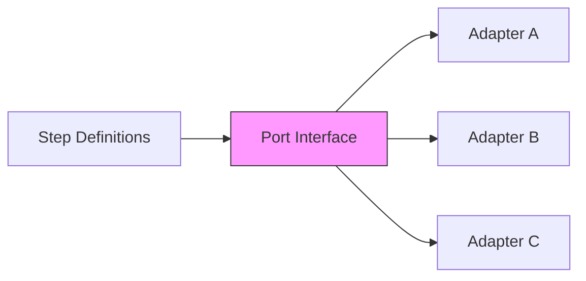

# Adding New Ports

Guide to creating new port interfaces for @kata/stack-tests.

## Overview

Ports define the contract between step definitions and adapters. They enable swapping implementations without changing test code.



## When to Create a Port

Create a new port when:
- Testing a new technology layer (database, message queue, etc.)
- Abstracting a third-party service (email, SMS, payment)
- Multiple implementations needed for different environments
- Decoupling tests from specific tools/libraries

## Port Design Principles

### 1. Technology Agnostic

```typescript
// Good - describes WHAT, not HOW
export interface EmailPort {
  sendEmail(to: string, subject: string, body: string): Promise<void>;
  getLastEmail(to: string): Promise<Email | null>;
}

// Avoid - leaks implementation details
export interface EmailPort {
  configureSMTP(host: string, port: number): void;
  sendViaSendGrid(apiKey: string, ...): Promise<void>;
}
```

### 2. Minimal Surface Area

```typescript
// Good - focused interface
export interface CachePort {
  get(key: string): Promise<string | null>;
  set(key: string, value: string, ttl?: number): Promise<void>;
  delete(key: string): Promise<void>;
}

// Avoid - too broad
export interface CachePort {
  get(key: string): Promise<string | null>;
  set(key: string, value: string): Promise<void>;
  delete(key: string): Promise<void>;
  getMany(keys: string[]): Promise<Map<string, string>>;
  setMany(entries: Map<string, string>): Promise<void>;
  keys(pattern: string): Promise<string[]>;
  flush(): Promise<void>;
  stats(): Promise<CacheStats>;
  // ... 20 more methods
}
```

### 3. Async by Default

```typescript
// Good - async even for potentially sync operations
export interface ConfigPort {
  getValue(key: string): Promise<string | null>;
  setValue(key: string, value: string): Promise<void>;
}

// Why? Allows implementations to:
// - Read from remote config services
// - Query databases
// - Make HTTP calls
```

### 4. Clear Error Contracts

```typescript
export interface DatabasePort {
  /**
   * Finds a record by ID.
   * @throws {RecordNotFoundError} When record doesn't exist
   * @throws {ConnectionError} When database is unreachable
   */
  findById(table: string, id: string): Promise<Record<string, unknown>>;
}
```

## Step-by-Step Guide

### 1. Define the Interface

Create `src/ports/[name].port.ts`:

```typescript
// src/ports/email.port.ts

/**
 * Port interface for email operations.
 * 
 * Used for testing email-related functionality without
 * sending real emails in tests.
 */
export interface EmailPort {
  /**
   * Sends an email.
   * @param to - Recipient email address
   * @param subject - Email subject line
   * @param body - Email body (HTML or plain text)
   */
  sendEmail(to: string, subject: string, body: string): Promise<void>;

  /**
   * Retrieves the most recent email sent to an address.
   * Useful for verification in tests.
   * @param to - Recipient email address to search
   * @returns The email if found, null otherwise
   */
  getLastEmail(to: string): Promise<Email | null>;

  /**
   * Waits for an email to arrive for the given address.
   * @param to - Recipient email address
   * @param options - Wait options
   * @returns The received email
   * @throws {TimeoutError} If email doesn't arrive within timeout
   */
  waitForEmail(to: string, options?: WaitOptions): Promise<Email>;

  /**
   * Clears all captured emails (for test isolation).
   */
  clearEmails(): Promise<void>;
}

/**
 * Email message structure.
 */
export interface Email {
  from: string;
  to: string;
  subject: string;
  body: string;
  html?: string;
  receivedAt: Date;
}

/**
 * Options for waiting on emails.
 */
export interface WaitOptions {
  /** Timeout in milliseconds (default: 30000) */
  timeout?: number;
  /** Subject pattern to match */
  subjectContains?: string;
}
```

### 2. Export from Ports Index

Update `src/ports/index.ts`:

```typescript
// Existing exports
export type { ApiPort } from './api.port.js';
export type { UiPort } from './ui.port.js';
export type { TuiPort } from './tui.port.js';
export type { AuthPort } from './auth.port.js';
export type { CleanupPort } from './cleanup.port.js';

// New export
export type { EmailPort, Email, WaitOptions } from './email.port.js';
```

### 3. Add to BddWorld Interface

Update `src/fixtures.ts`:

```typescript
import type { EmailPort } from './ports/email.port.js';

export interface BddWorld {
  // Existing ports
  api: ApiPort;
  ui: UiPort;
  tui?: TuiPort;
  auth: AuthPort;
  cleanup: CleanupPort;
  
  // New port
  email?: EmailPort;
  
  // State
  variables: Record<string, string>;
  lastStatus?: number;
  lastJson?: unknown;
  // ...
}

export interface BddTestOptions {
  createApi?: (request: APIRequestContext) => ApiPort;
  createUi?: (page: Page) => UiPort;
  createTui?: () => TuiPort;
  createAuth?: () => AuthPort;
  createCleanup?: () => CleanupPort;
  
  // New factory
  createEmail?: () => EmailPort;
}
```

### 4. Update createBddTest

```typescript
export function createBddTest(options: BddTestOptions) {
  return test.extend<{ world: BddWorld }>({
    world: async ({ request, page }, use) => {
      const world: BddWorld = {
        api: options.createApi?.(request),
        ui: options.createUi?.(page),
        tui: options.createTui?.(),
        auth: options.createAuth?.(),
        cleanup: options.createCleanup?.(),
        
        // Initialize new port
        email: options.createEmail?.(),
        
        variables: {},
      };
      
      await use(world);
      
      // Cleanup
      await world.cleanup?.executeCleanup();
      await world.email?.clearEmails();
    },
  });
}
```

### 5. Export from Main Index

Update `src/index.ts`:

```typescript
// Types
export type {
  ApiPort,
  UiPort,
  TuiPort,
  AuthPort,
  CleanupPort,
  EmailPort,        // New
  Email,            // New
  WaitOptions,      // New
} from './ports/index.js';
```

### 6. Document in Reference

Create or update `docs/reference/api/ports.md` to include the new port.

## Complete Example: DatabasePort

### Port Definition

```typescript
// src/ports/database.port.ts

/**
 * Port interface for database operations.
 * 
 * Enables direct database access in tests for setup,
 * verification, and cleanup purposes.
 */
export interface DatabasePort {
  /**
   * Executes a raw SQL query.
   * @param sql - SQL statement with placeholders
   * @param params - Parameters to bind
   * @returns Query result rows
   */
  query<T = Record<string, unknown>>(
    sql: string,
    params?: unknown[]
  ): Promise<T[]>;

  /**
   * Inserts a record and returns the created row.
   * @param table - Table name
   * @param data - Record data
   * @returns Inserted record with generated fields
   */
  insert(
    table: string,
    data: Record<string, unknown>
  ): Promise<Record<string, unknown>>;

  /**
   * Finds a single record by ID.
   * @param table - Table name
   * @param id - Record ID
   * @returns Record or null if not found
   */
  findById(
    table: string,
    id: string
  ): Promise<Record<string, unknown> | null>;

  /**
   * Updates a record by ID.
   * @param table - Table name
   * @param id - Record ID
   * @param data - Fields to update
   */
  update(
    table: string,
    id: string,
    data: Record<string, unknown>
  ): Promise<void>;

  /**
   * Deletes a record by ID.
   * @param table - Table name
   * @param id - Record ID
   */
  delete(table: string, id: string): Promise<void>;

  /**
   * Starts a transaction.
   * All operations until commit/rollback are transactional.
   */
  beginTransaction(): Promise<void>;

  /**
   * Commits the current transaction.
   */
  commit(): Promise<void>;

  /**
   * Rolls back the current transaction.
   */
  rollback(): Promise<void>;

  /**
   * Closes the database connection.
   */
  close(): Promise<void>;
}
```

### Fixture Integration

```typescript
// In fixtures.ts

export interface BddTestOptions {
  // ...existing options
  createDatabase?: () => DatabasePort;
}

// In createBddTest
world.database = options.createDatabase?.();

// In cleanup
await world.database?.close();
```

## Testing New Ports

### Unit Tests for Interface Contracts

```typescript
// tests/ports/email.port.test.ts

describe('EmailPort interface', () => {
  it('should define sendEmail method', () => {
    const port: EmailPort = createMockEmailPort();
    expect(port.sendEmail).toBeDefined();
  });

  it('should define getLastEmail method', () => {
    const port: EmailPort = createMockEmailPort();
    expect(port.getLastEmail).toBeDefined();
  });

  it('should define waitForEmail method', () => {
    const port: EmailPort = createMockEmailPort();
    expect(port.waitForEmail).toBeDefined();
  });
});
```

## Checklist

- [ ] Interface defined in `src/ports/[name].port.ts`
- [ ] Exported from `src/ports/index.ts`
- [ ] Added to `BddWorld` interface
- [ ] Added to `BddTestOptions` interface
- [ ] Integrated in `createBddTest` function
- [ ] Exported from `src/index.ts`
- [ ] Unit tests written
- [ ] JSDoc comments added
- [ ] Documentation updated in `docs/reference/api/ports.md`

## Related Guides

- [Adding Adapters](./adding-adapters.md) - Implement the port
- [Adding Steps](./adding-steps.md) - Create step definitions
- [Coding Standards](./coding-standards.md) - Style guidelines
- [Architecture](../concepts/architecture.md) - Ports & Adapters pattern
