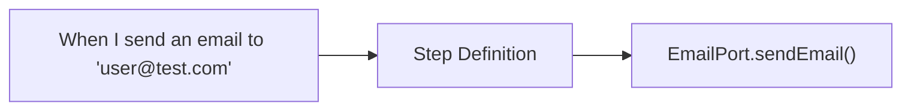

# Adding Step Definitions

Guide to creating new step definitions for @kata/stack-tests.

## Overview

Step definitions bridge Gherkin feature files with port operations. They translate natural language into code.



## Step Definition Structure

### Basic Pattern

```typescript
// steps/email.basic.ts

import type { BddWorld } from '../fixtures.js';

export function registerEmailSteps(
  Given: GivenFunction,
  When: WhenFunction,
  Then: ThenFunction
): void {
  
  When(
    'I send an email to {string} with subject {string}',
    async function(this: BddWorld, to: string, subject: string) {
      await this.email.sendEmail(to, subject, 'Default body');
    }
  );
  
}
```

### With DocString

```typescript
When(
  'I send an email to {string} with subject {string} and body:',
  async function(this: BddWorld, to: string, subject: string, body: string) {
    await this.email.sendEmail(to, subject, body);
  }
);
```

Usage in feature file:
```gherkin
When I send an email to "user@test.com" with subject "Welcome" and body:
  """
  Hello!
  
  Welcome to our platform.
  """
```

### With Data Table

```typescript
When(
  'I send emails to the following recipients:',
  async function(this: BddWorld, dataTable: DataTable) {
    const rows = dataTable.hashes();
    
    for (const row of rows) {
      await this.email.sendEmail(row.to, row.subject, row.body);
    }
  }
);
```

Usage:
```gherkin
When I send emails to the following recipients:
  | to                | subject     | body          |
  | alice@test.com    | Hello Alice | Welcome Alice |
  | bob@test.com      | Hello Bob   | Welcome Bob   |
```

## Step Categories

### Given Steps (Setup)

```typescript
// Preconditions - setup state before action
Given(
  'an email exists for {string}',
  async function(this: BddWorld, email: string) {
    // Seed test data via mock or API
    if (this.email instanceof MockEmailAdapter) {
      this.email.addEmail({
        from: 'system@test.com',
        to: email,
        subject: 'Test Email',
        body: 'Test content',
        receivedAt: new Date(),
      });
    }
  }
);

Given(
  'no emails exist',
  async function(this: BddWorld) {
    await this.email.clearEmails();
  }
);
```

### When Steps (Actions)

```typescript
// Actions that trigger behavior
When(
  'I send an email to {string}',
  async function(this: BddWorld, to: string) {
    await this.email.sendEmail(to, 'Default Subject', 'Default Body');
    this.variables['lastEmailTo'] = to;
  }
);

When(
  'I wait for an email to {string}',
  async function(this: BddWorld, to: string) {
    const email = await this.email.waitForEmail(to);
    this.lastEmail = email;
  }
);
```

### Then Steps (Assertions)

```typescript
// Verify outcomes
Then(
  'an email should have been sent to {string}',
  async function(this: BddWorld, to: string) {
    const email = await this.email.getLastEmail(to);
    expect(email).not.toBeNull();
  }
);

Then(
  'the email subject should be {string}',
  async function(this: BddWorld, expectedSubject: string) {
    expect(this.lastEmail).toBeDefined();
    expect(this.lastEmail.subject).toBe(expectedSubject);
  }
);

Then(
  'the email body should contain {string}',
  async function(this: BddWorld, text: string) {
    expect(this.lastEmail).toBeDefined();
    expect(this.lastEmail.body).toContain(text);
  }
);
```

## Step-by-Step Guide

### 1. Plan Step Definitions

List the Gherkin steps you want to support:

```gherkin
# Email steps to implement
Given no emails exist
Given an email exists for {string} with subject {string}
When I send an email to {string} with subject {string}
When I send an email to {string} with subject {string} and body:
When I wait for an email to {string}
When I wait for an email to {string} with subject containing {string}
Then an email should have been sent to {string}
Then the email subject should be {string}
Then the email subject should contain {string}
Then the email body should contain {string}
Then I store the email subject as {string}
```

### 2. Create Step File

```typescript
// src/steps/email.basic.ts

import { expect } from '@playwright/test';
import type { DataTable } from '@cucumber/cucumber';
import type { BddWorld } from '../fixtures.js';
import type { GivenFunction, WhenFunction, ThenFunction } from './types.js';

/**
 * Register basic email step definitions.
 * 
 * These steps require the @email tag on scenarios and
 * an EmailPort adapter configured in fixtures.
 * 
 * @example
 * ```gherkin
 * @email
 * Scenario: Send welcome email
 *   When I send an email to "user@test.com" with subject "Welcome"
 *   Then an email should have been sent to "user@test.com"
 * ```
 */
export function registerEmailSteps(
  Given: GivenFunction,
  When: WhenFunction,
  Then: ThenFunction
): void {
  
  // ============================================
  // Given Steps (Setup)
  // ============================================
  
  Given(
    'no emails exist',
    async function(this: BddWorld) {
      await this.email?.clearEmails();
    }
  );
  
  Given(
    'an email exists for {string} with subject {string}',
    async function(this: BddWorld, to: string, subject: string) {
      // This typically requires mock adapter for seeding
      throw new Error(
        'Seeding emails requires MockEmailAdapter. ' +
        'Use real email flow in integration tests.'
      );
    }
  );
  
  // ============================================
  // When Steps (Actions)
  // ============================================
  
  When(
    'I send an email to {string} with subject {string}',
    async function(this: BddWorld, to: string, subject: string) {
      const resolvedTo = this.resolveVariables(to);
      const resolvedSubject = this.resolveVariables(subject);
      
      await this.email!.sendEmail(resolvedTo, resolvedSubject, '');
      this.variables['lastEmailTo'] = resolvedTo;
      this.variables['lastEmailSubject'] = resolvedSubject;
    }
  );
  
  When(
    'I send an email to {string} with subject {string} and body:',
    async function(this: BddWorld, to: string, subject: string, body: string) {
      const resolvedTo = this.resolveVariables(to);
      const resolvedSubject = this.resolveVariables(subject);
      const resolvedBody = this.resolveVariables(body);
      
      await this.email!.sendEmail(resolvedTo, resolvedSubject, resolvedBody);
    }
  );
  
  When(
    'I wait for an email to {string}',
    async function(this: BddWorld, to: string) {
      const resolvedTo = this.resolveVariables(to);
      const email = await this.email!.waitForEmail(resolvedTo);
      this.lastEmail = email;
    }
  );
  
  When(
    'I wait for an email to {string} with subject containing {string}',
    async function(this: BddWorld, to: string, subjectContains: string) {
      const resolvedTo = this.resolveVariables(to);
      const resolvedSubject = this.resolveVariables(subjectContains);
      
      const email = await this.email!.waitForEmail(resolvedTo, {
        subjectContains: resolvedSubject,
      });
      this.lastEmail = email;
    }
  );
  
  // ============================================
  // Then Steps (Assertions)
  // ============================================
  
  Then(
    'an email should have been sent to {string}',
    async function(this: BddWorld, to: string) {
      const resolvedTo = this.resolveVariables(to);
      const email = await this.email!.getLastEmail(resolvedTo);
      
      expect(email, `Expected email to ${resolvedTo}`).not.toBeNull();
    }
  );
  
  Then(
    'the email subject should be {string}',
    async function(this: BddWorld, expectedSubject: string) {
      const resolved = this.resolveVariables(expectedSubject);
      
      expect(this.lastEmail, 'No email captured').toBeDefined();
      expect(this.lastEmail!.subject).toBe(resolved);
    }
  );
  
  Then(
    'the email subject should contain {string}',
    async function(this: BddWorld, text: string) {
      const resolved = this.resolveVariables(text);
      
      expect(this.lastEmail, 'No email captured').toBeDefined();
      expect(this.lastEmail!.subject).toContain(resolved);
    }
  );
  
  Then(
    'the email body should contain {string}',
    async function(this: BddWorld, text: string) {
      const resolved = this.resolveVariables(text);
      
      expect(this.lastEmail, 'No email captured').toBeDefined();
      expect(this.lastEmail!.body).toContain(resolved);
    }
  );
  
  Then(
    'I store the email subject as {string}',
    async function(this: BddWorld, varName: string) {
      expect(this.lastEmail, 'No email captured').toBeDefined();
      this.variables[varName] = this.lastEmail!.subject;
    }
  );
}
```

### 3. Export from Steps Index

Update `src/steps/index.ts`:

```typescript
// Existing exports
export { registerApiSteps } from './api.basic.js';
export { registerApiAuthSteps } from './api.auth.js';
export { registerUiSteps } from './ui.basic.js';
export { registerTuiSteps } from './tui.basic.js';
export { registerSharedSteps } from './shared.variables.js';
export { registerHybridSteps } from './hybrid.js';

// New export
export { registerEmailSteps } from './email.basic.js';

// Convenience function to register all steps
export function registerAllSteps(
  Given: GivenFunction,
  When: WhenFunction,
  Then: ThenFunction
): void {
  registerApiSteps(Given, When, Then);
  registerApiAuthSteps(Given, When, Then);
  registerUiSteps(Given, When, Then);
  registerTuiSteps(Given, When, Then);
  registerSharedSteps(Given, When, Then);
  registerHybridSteps(Given, When, Then);
  registerEmailSteps(Given, When, Then);  // New
}
```

### 4. Update BddWorld (if needed)

Add any new state properties:

```typescript
// src/fixtures.ts

export interface BddWorld {
  // Existing...
  
  // New state for email steps
  lastEmail?: Email;
}
```

### 5. Document Steps

Create `docs/reference/steps/email-steps.md`:

```markdown
# Email Step Definitions

Step definitions for testing email functionality.

## Tag

Use `@email` tag on scenarios that use these steps.

## Setup Steps

### Clear emails
\`\`\`gherkin
Given no emails exist
\`\`\`

## Action Steps

### Send email
\`\`\`gherkin
When I send an email to "user@test.com" with subject "Welcome"
\`\`\`

### Send email with body
\`\`\`gherkin
When I send an email to "user@test.com" with subject "Welcome" and body:
  """
  Hello and welcome!
  """
\`\`\`

... etc
```

## Best Practices

### 1. Variable Resolution

Always resolve variables in string parameters:

```typescript
When(
  'I send an email to {string}',
  async function(this: BddWorld, to: string) {
    // Resolves {varName} patterns
    const resolvedTo = this.resolveVariables(to);
    await this.email!.sendEmail(resolvedTo, 'Subject', 'Body');
  }
);
```

Usage:
```gherkin
Given I set variable "userEmail" to "test@example.com"
When I send an email to "{userEmail}"
```

### 2. Clear Error Messages

```typescript
Then(
  'the email body should contain {string}',
  async function(this: BddWorld, text: string) {
    expect(
      this.lastEmail,
      'No email captured. Use "When I wait for an email" first.'
    ).toBeDefined();
    
    expect(
      this.lastEmail!.body,
      `Email body should contain "${text}"`
    ).toContain(text);
  }
);
```

### 3. Store State for Chaining

```typescript
When(
  'I wait for an email to {string}',
  async function(this: BddWorld, to: string) {
    const email = await this.email!.waitForEmail(to);
    
    // Store for subsequent Then steps
    this.lastEmail = email;
    
    // Also store key fields as variables
    this.variables['emailSubject'] = email.subject;
    this.variables['emailFrom'] = email.from;
  }
);
```

### 4. Optional Port Guards

```typescript
When(
  'I send an email to {string}',
  async function(this: BddWorld, to: string) {
    if (!this.email) {
      throw new Error(
        'EmailPort not configured. Add createEmail to your fixture options.'
      );
    }
    
    await this.email.sendEmail(to, 'Subject', 'Body');
  }
);
```

### 5. Consistent Naming

Follow the pattern: `[action] [object] [details]`

```gherkin
# Good - consistent pattern
When I send an email to {string}
When I send a request to {string}
When I click the button {string}

# Avoid - inconsistent
When email is sent to {string}
When {string} receives an email
When clicking on {string}
```

## Testing Steps

```typescript
// tests/steps/email.steps.test.ts

import { describe, it, expect, beforeEach } from 'vitest';
import { registerEmailSteps } from '../../src/steps/email.basic.js';
import { MockEmailAdapter } from '../../src/adapters/email/mock-email.adapter.js';

describe('Email Step Definitions', () => {
  let world: BddWorld;
  let steps: Map<string, Function>;

  beforeEach(() => {
    world = createTestWorld({
      email: new MockEmailAdapter(),
    });
    
    steps = new Map();
    registerEmailSteps(
      (pattern, fn) => steps.set(`Given ${pattern}`, fn.bind(world)),
      (pattern, fn) => steps.set(`When ${pattern}`, fn.bind(world)),
      (pattern, fn) => steps.set(`Then ${pattern}`, fn.bind(world))
    );
  });

  describe('When I send an email to {string}', () => {
    it('should call email port sendEmail', async () => {
      const step = steps.get('When I send an email to {string} with subject {string}');
      
      await step('test@example.com', 'Hello');
      
      const emails = (world.email as MockEmailAdapter).getAllEmails();
      expect(emails).toHaveLength(1);
      expect(emails[0].to).toBe('test@example.com');
    });
  });

  describe('Then an email should have been sent to {string}', () => {
    it('should pass when email exists', async () => {
      (world.email as MockEmailAdapter).addEmail({
        from: 'sender@test.com',
        to: 'recipient@test.com',
        subject: 'Test',
        body: 'Body',
        receivedAt: new Date(),
      });

      const step = steps.get('Then an email should have been sent to {string}');
      
      await expect(step('recipient@test.com')).resolves.not.toThrow();
    });

    it('should fail when email missing', async () => {
      const step = steps.get('Then an email should have been sent to {string}');
      
      await expect(step('missing@test.com')).rejects.toThrow();
    });
  });
});
```

## Checklist

- [ ] Steps follow Given/When/Then pattern
- [ ] Variable resolution in all string params
- [ ] Clear error messages
- [ ] State stored for step chaining
- [ ] Exported from steps index
- [ ] JSDoc documentation
- [ ] Unit tests written
- [ ] Reference documentation updated

## Related Guides

- [Adding Ports](./adding-ports.md) - Define interfaces
- [Adding Adapters](./adding-adapters.md) - Implement ports
- [Custom Steps Guide](../guides/custom-steps.md) - Usage guide
- [API Steps Reference](../reference/steps/api-steps.md) - Example reference
