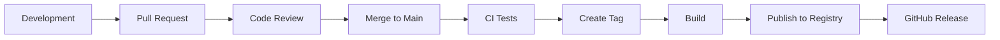

# Release Process

Guide to versioning, releasing, and publishing @kata/stack-tests packages.

## Overview



## Versioning

We follow [Semantic Versioning](https://semver.org/):

| Version | When to Bump | Example Changes |
|---------|--------------|-----------------|
| MAJOR (X.0.0) | Breaking changes | Remove/rename port methods, change fixture API |
| MINOR (0.X.0) | New features | Add new port, add adapter, add steps |
| PATCH (0.0.X) | Bug fixes | Fix adapter bug, improve error messages |

### Pre-release Versions

```
0.1.0-alpha.1    # Alpha release
0.1.0-beta.1     # Beta release
0.1.0-rc.1       # Release candidate
```

## Packages

| Package | Registry | Scope |
|---------|----------|-------|
| @kata/stack-tests | GitHub Packages | @kata |
| create-stack-tests | GitHub Packages | @kata |

## Release Workflow

### 1. Prepare Release Branch

```bash
# Ensure main is up to date
git checkout main
git pull origin main

# Create release branch
git checkout -b release/v0.2.0
```

### 2. Update Version Numbers

Update `package.json` in each package:

```bash
# Update stack-tests
cd stack-tests
npm version 0.2.0 --no-git-tag-version

# Update create-stack-tests
cd ../create-stack-tests
npm version 0.2.0 --no-git-tag-version
```

### 3. Update Changelog

Add entry to `CHANGELOG.md`:

```markdown
## [0.2.0] - 2024-01-20

### Added
- TUI testing support with TuiPort and TuiTesterAdapter
- New step definitions for terminal UI testing
- `@tui` tag for TUI-only scenarios

### Changed
- Updated Playwright peer dependency to ^1.49.0

### Fixed
- API adapter timeout handling (#123)

### Contributors
- @username1 - TUI adapter implementation
- @username2 - Bug fixes
```

### 4. Build and Test

```bash
# Build all packages
npm run build --workspaces

# Run full test suite
npm test --workspaces

# Run linter
npm run lint --workspaces
```

### 5. Create Pull Request

```bash
git add .
git commit -m "chore: prepare release v0.2.0"
git push origin release/v0.2.0
```

Create PR titled: `Release v0.2.0`

### 6. Merge and Tag

After PR approval and merge:

```bash
git checkout main
git pull origin main

# Create annotated tag
git tag -a v0.2.0 -m "Release v0.2.0"
git push origin v0.2.0
```

### 7. Automated Publishing

The CI pipeline automatically:
1. Detects the new tag
2. Builds packages
3. Publishes to GitHub Packages
4. Creates GitHub Release

## Manual Publishing (if needed)

### GitHub Packages Authentication

```bash
# Login to GitHub Packages
npm login --registry=https://npm.pkg.github.com --scope=@kata

# Or use .npmrc
echo "//npm.pkg.github.com/:_authToken=${GITHUB_TOKEN}" >> ~/.npmrc
echo "@kata:registry=https://npm.pkg.github.com" >> ~/.npmrc
```

### Publish

```bash
# Publish stack-tests
cd stack-tests
npm publish

# Publish create-stack-tests
cd ../create-stack-tests
npm publish
```

## CI/CD Configuration

### GitHub Actions Workflow

```yaml
# .github/workflows/release.yml
name: Release

on:
  push:
    tags:
      - 'v*'

jobs:
  release:
    runs-on: ubuntu-latest
    permissions:
      contents: write
      packages: write
    
    steps:
      - uses: actions/checkout@v4
      
      - uses: actions/setup-node@v4
        with:
          node-version: '20'
          registry-url: 'https://npm.pkg.github.com'
          scope: '@kata'
      
      - name: Install dependencies
        run: npm ci
      
      - name: Build
        run: npm run build --workspaces
      
      - name: Test
        run: npm test --workspaces
      
      - name: Publish stack-tests
        run: npm publish
        working-directory: stack-tests
        env:
          NODE_AUTH_TOKEN: ${{ secrets.GITHUB_TOKEN }}
      
      - name: Publish create-stack-tests
        run: npm publish
        working-directory: create-stack-tests
        env:
          NODE_AUTH_TOKEN: ${{ secrets.GITHUB_TOKEN }}
      
      - name: Create GitHub Release
        uses: softprops/action-gh-release@v1
        with:
          generate_release_notes: true
          files: |
            stack-tests/dist/**
```

## Changelog Format

Follow [Keep a Changelog](https://keepachangelog.com/):

```markdown
# Changelog

All notable changes to this project will be documented in this file.

The format is based on [Keep a Changelog](https://keepachangelog.com/en/1.0.0/),
and this project adheres to [Semantic Versioning](https://semver.org/spec/v2.0.0.html).

## [Unreleased]

### Added
- Feature in progress

## [0.2.0] - 2024-01-20

### Added
- New feature A
- New feature B

### Changed
- Changed behavior X

### Deprecated
- Feature Y (use Z instead)

### Removed
- Removed feature W

### Fixed
- Bug fix for issue #123

### Security
- Security update for CVE-XXXX

## [0.1.0] - 2024-01-01

### Added
- Initial release
```

## Hotfix Process

For urgent fixes to released versions:

```bash
# Create hotfix branch from tag
git checkout -b hotfix/v0.2.1 v0.2.0

# Make fix
# ... edit files ...

# Update version
npm version 0.2.1 --no-git-tag-version -w stack-tests

# Commit and push
git add .
git commit -m "fix: critical bug in API adapter"
git push origin hotfix/v0.2.1

# Create PR, then after merge:
git checkout main
git pull
git tag -a v0.2.1 -m "Hotfix v0.2.1"
git push origin v0.2.1
```

## Breaking Changes

When introducing breaking changes:

1. **Document in CHANGELOG**
   ```markdown
   ### BREAKING CHANGES
   - `ApiPort.get()` now returns `Response` instead of `Promise<Response>`
   ```

2. **Add migration guide**
   ```markdown
   ## Migrating from 0.x to 1.0

   ### ApiPort changes
   
   Before:
   ```typescript
   const response = await api.get('/users');
   ```
   
   After:
   ```typescript
   const response = api.get('/users');
   await response.json();
   ```
   ```

3. **Deprecation period** (if possible)
   - Add deprecation warnings in minor version
   - Remove in next major version

## Release Checklist

### Pre-release
- [ ] All tests passing on main
- [ ] Changelog updated
- [ ] Version numbers updated
- [ ] Documentation updated for new features
- [ ] Breaking changes documented
- [ ] Migration guide written (if breaking)

### Release
- [ ] Release branch created and merged
- [ ] Tag created and pushed
- [ ] CI pipeline successful
- [ ] Packages published to registry
- [ ] GitHub Release created

### Post-release
- [ ] Verify packages installable (`npm install @kata/stack-tests@0.2.0`)
- [ ] Announce release (Discord, email, etc.)
- [ ] Update example projects
- [ ] Monitor for issues

## Troubleshooting

### Package not found after publish

```bash
# Check package exists
npm view @kata/stack-tests@0.2.0

# Clear npm cache
npm cache clean --force

# Try installing again
npm install @kata/stack-tests@0.2.0
```

### Authentication errors

```bash
# Verify token
npm whoami --registry=https://npm.pkg.github.com

# Check .npmrc
cat ~/.npmrc | grep npm.pkg.github.com
```

### Version conflict

```bash
# Unpublish (within 72 hours)
npm unpublish @kata/stack-tests@0.2.0

# Or deprecate
npm deprecate @kata/stack-tests@0.2.0 "Use 0.2.1 instead"
```

## Related Guides

- [CONTRIBUTING.md](./CONTRIBUTING.md) - Contribution guidelines
- [Development Setup](./development-setup.md) - Local setup
- [CI/CD Guide](../guides/ci-cd.md) - CI configuration
