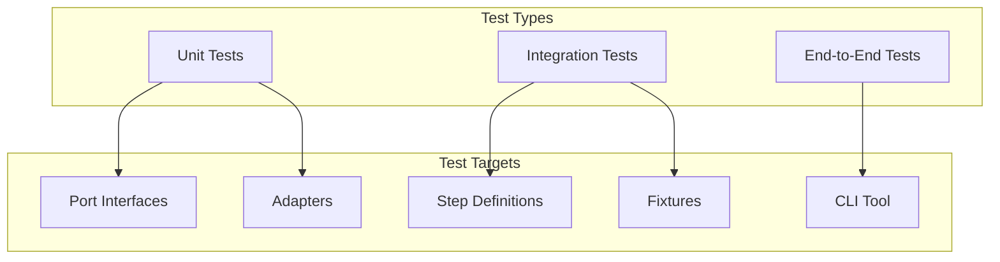

# Testing the Framework

Guide to writing and running tests for @kata/stack-tests itself.

## Test Architecture



## Running Tests

### All Tests

```bash
# Run complete test suite
npm test

# Run with coverage
npm test -- --coverage

# Run in watch mode
npm test -- --watch
```

### Specific Tests

```bash
# By file pattern
npm test -- --grep "ApiPort"

# By test name
npm test -- --grep "should return JSON response"

# Single file
npm test -- stack-tests/tests/adapters/api.test.ts
```

### Debug Mode

```bash
# With Playwright inspector
PWDEBUG=1 npm test

# With verbose output
npm test -- --verbose

# Single worker for sequential execution
npm test -- --workers=1
```

## Unit Tests

### Testing Ports (Interfaces)

Ports are interfaces, so we test them via mock implementations:

```typescript
// tests/ports/api.port.test.ts

import { describe, it, expect, vi } from 'vitest';
import type { ApiPort } from '../../src/ports/api.port.js';

describe('ApiPort', () => {
  // Create mock implementation for testing
  const createMockApiPort = (): ApiPort => ({
    get: vi.fn(),
    post: vi.fn(),
    put: vi.fn(),
    patch: vi.fn(),
    delete: vi.fn(),
    setHeader: vi.fn(),
    clearHeaders: vi.fn(),
  });

  describe('interface contract', () => {
    it('should define all required HTTP methods', () => {
      const api = createMockApiPort();
      
      expect(api.get).toBeDefined();
      expect(api.post).toBeDefined();
      expect(api.put).toBeDefined();
      expect(api.patch).toBeDefined();
      expect(api.delete).toBeDefined();
    });

    it('should define header management methods', () => {
      const api = createMockApiPort();
      
      expect(api.setHeader).toBeDefined();
      expect(api.clearHeaders).toBeDefined();
    });
  });
});
```

### Testing Adapters

```typescript
// tests/adapters/playwright-api.adapter.test.ts

import { describe, it, expect, beforeEach, vi } from 'vitest';
import { PlaywrightApiAdapter } from '../../src/adapters/api/playwright-api.adapter.js';

describe('PlaywrightApiAdapter', () => {
  let adapter: PlaywrightApiAdapter;
  let mockRequest: any;

  beforeEach(() => {
    mockRequest = {
      get: vi.fn(),
      post: vi.fn(),
      put: vi.fn(),
      patch: vi.fn(),
      delete: vi.fn(),
    };
    
    adapter = new PlaywrightApiAdapter(mockRequest, {
      baseUrl: 'http://api.test.com',
    });
  });

  describe('get()', () => {
    it('should make GET request with correct URL', async () => {
      mockRequest.get.mockResolvedValue({
        status: () => 200,
        json: () => Promise.resolve({ id: '1' }),
      });

      await adapter.get('/users/1');

      expect(mockRequest.get).toHaveBeenCalledWith(
        'http://api.test.com/users/1',
        expect.any(Object)
      );
    });

    it('should include custom headers in request', async () => {
      mockRequest.get.mockResolvedValue({
        status: () => 200,
        json: () => Promise.resolve({}),
      });

      adapter.setHeader('Authorization', 'Bearer token');
      await adapter.get('/protected');

      expect(mockRequest.get).toHaveBeenCalledWith(
        expect.any(String),
        expect.objectContaining({
          headers: expect.objectContaining({
            'Authorization': 'Bearer token',
          }),
        })
      );
    });

    it('should return response with status and body', async () => {
      const mockBody = { id: '1', name: 'Test' };
      mockRequest.get.mockResolvedValue({
        status: () => 200,
        json: () => Promise.resolve(mockBody),
      });

      const response = await adapter.get('/users/1');

      expect(response.status).toBe(200);
      expect(response.body).toEqual(mockBody);
    });
  });

  describe('post()', () => {
    it('should send JSON body with correct content type', async () => {
      mockRequest.post.mockResolvedValue({
        status: () => 201,
        json: () => Promise.resolve({ id: '2' }),
      });

      const body = { email: 'test@example.com' };
      await adapter.post('/users', body);

      expect(mockRequest.post).toHaveBeenCalledWith(
        expect.any(String),
        expect.objectContaining({
          data: body,
          headers: expect.objectContaining({
            'Content-Type': 'application/json',
          }),
        })
      );
    });
  });

  describe('setHeader()', () => {
    it('should persist headers across requests', async () => {
      mockRequest.get.mockResolvedValue({
        status: () => 200,
        json: () => Promise.resolve({}),
      });

      adapter.setHeader('X-Custom', 'value');
      
      await adapter.get('/endpoint1');
      await adapter.get('/endpoint2');

      expect(mockRequest.get).toHaveBeenNthCalledWith(
        1,
        expect.any(String),
        expect.objectContaining({
          headers: expect.objectContaining({ 'X-Custom': 'value' }),
        })
      );
      
      expect(mockRequest.get).toHaveBeenNthCalledWith(
        2,
        expect.any(String),
        expect.objectContaining({
          headers: expect.objectContaining({ 'X-Custom': 'value' }),
        })
      );
    });
  });

  describe('clearHeaders()', () => {
    it('should remove all custom headers', async () => {
      mockRequest.get.mockResolvedValue({
        status: () => 200,
        json: () => Promise.resolve({}),
      });

      adapter.setHeader('X-Custom', 'value');
      adapter.clearHeaders();
      
      await adapter.get('/endpoint');

      expect(mockRequest.get).toHaveBeenCalledWith(
        expect.any(String),
        expect.objectContaining({
          headers: expect.not.objectContaining({ 'X-Custom': 'value' }),
        })
      );
    });
  });
});
```

### Testing Utilities

```typescript
// tests/utils/variable-interpolation.test.ts

import { describe, it, expect } from 'vitest';
import { interpolateVariables } from '../../src/utils/variables.js';

describe('interpolateVariables()', () => {
  it('should replace single variable', () => {
    const result = interpolateVariables(
      '/users/{userId}',
      { userId: '123' }
    );
    
    expect(result).toBe('/users/123');
  });

  it('should replace multiple variables', () => {
    const result = interpolateVariables(
      '/teams/{teamId}/members/{memberId}',
      { teamId: 'team-1', memberId: 'member-2' }
    );
    
    expect(result).toBe('/teams/team-1/members/member-2');
  });

  it('should leave unknown variables unchanged', () => {
    const result = interpolateVariables(
      '/users/{unknownVar}',
      { userId: '123' }
    );
    
    expect(result).toBe('/users/{unknownVar}');
  });

  it('should handle empty variables object', () => {
    const result = interpolateVariables('/users/{id}', {});
    
    expect(result).toBe('/users/{id}');
  });
});
```

## Integration Tests

### Testing Step Definitions

```typescript
// tests/steps/api.steps.integration.test.ts

import { describe, it, expect, beforeEach } from 'vitest';
import { createBddWorld } from '../../src/fixtures.js';

describe('API Step Definitions', () => {
  let world: BddWorld;

  beforeEach(() => {
    world = createBddWorld({
      api: createMockApiAdapter(),
    });
  });

  describe('When I GET {string}', () => {
    it('should store response in world state', async () => {
      // Simulate step execution
      await world.api.get('/users/1');
      
      // Verify world state updated
      expect(world.lastStatus).toBeDefined();
      expect(world.lastJson).toBeDefined();
    });
  });

  describe('Then the value at {string} should equal {string}', () => {
    it('should pass when values match', async () => {
      world.lastJson = { user: { name: 'John' } };
      
      // This should not throw
      expect(world.lastJson.user.name).toBe('John');
    });

    it('should fail when values differ', async () => {
      world.lastJson = { user: { name: 'Jane' } };
      
      expect(world.lastJson.user.name).not.toBe('John');
    });
  });

  describe('And I store the value at {string} as {string}', () => {
    it('should store nested values in variables', async () => {
      world.lastJson = { data: { id: '123' } };
      
      // Simulate step
      world.variables['userId'] = world.lastJson.data.id;
      
      expect(world.variables['userId']).toBe('123');
    });
  });
});
```

### Testing Fixtures

```typescript
// tests/fixtures.test.ts

import { describe, it, expect } from 'vitest';
import { createBddTest } from '../src/fixtures.js';

describe('createBddTest()', () => {
  it('should create test fixture with API adapter', () => {
    const { test } = createBddTest({
      createApi: (request) => new MockApiAdapter(request),
    });
    
    expect(test).toBeDefined();
  });

  it('should create test fixture with UI adapter', () => {
    const { test } = createBddTest({
      createUi: (page) => new MockUiAdapter(page),
    });
    
    expect(test).toBeDefined();
  });

  it('should create test fixture with all adapters', () => {
    const { test } = createBddTest({
      createApi: (request) => new MockApiAdapter(request),
      createUi: (page) => new MockUiAdapter(page),
      createAuth: () => new MockAuthAdapter(),
      createCleanup: () => new MockCleanupAdapter(),
    });
    
    expect(test).toBeDefined();
  });
});
```

## End-to-End Tests

### Testing CLI Scaffolding

```typescript
// tests/e2e/create-stack-tests.test.ts

import { describe, it, expect, beforeAll, afterAll } from 'vitest';
import { execSync } from 'node:child_process';
import { existsSync, rmSync } from 'node:fs';
import { join } from 'node:path';

describe('create-stack-tests CLI', () => {
  const testDir = join(__dirname, 'test-output');
  const projectDir = join(testDir, 'my-test-project');

  beforeAll(() => {
    // Clean up from previous runs
    if (existsSync(testDir)) {
      rmSync(testDir, { recursive: true });
    }
  });

  afterAll(() => {
    // Clean up after tests
    if (existsSync(testDir)) {
      rmSync(testDir, { recursive: true });
    }
  });

  it('should scaffold a new project', () => {
    execSync(`npx create-stack-tests ${projectDir}`, {
      stdio: 'pipe',
    });

    expect(existsSync(projectDir)).toBe(true);
  });

  it('should create package.json with correct dependencies', () => {
    const pkgPath = join(projectDir, 'package.json');
    expect(existsSync(pkgPath)).toBe(true);

    const pkg = JSON.parse(readFileSync(pkgPath, 'utf-8'));
    expect(pkg.dependencies).toHaveProperty('@kata/stack-tests');
    expect(pkg.dependencies).toHaveProperty('@playwright/test');
  });

  it('should create example feature files', () => {
    const featuresDir = join(projectDir, 'features');
    expect(existsSync(featuresDir)).toBe(true);
    expect(existsSync(join(featuresDir, 'api.feature'))).toBe(true);
  });

  it('should create playwright config', () => {
    expect(existsSync(join(projectDir, 'playwright.config.ts'))).toBe(true);
  });

  it('should run tests successfully', () => {
    const result = execSync('npm test', {
      cwd: projectDir,
      stdio: 'pipe',
    });

    expect(result.toString()).toContain('passed');
  });
});
```

## Test Coverage

### Coverage Configuration

```typescript
// vitest.config.ts

export default defineConfig({
  test: {
    coverage: {
      provider: 'v8',
      reporter: ['text', 'html', 'lcov'],
      include: ['src/**/*.ts'],
      exclude: [
        'src/**/*.d.ts',
        'src/**/*.test.ts',
        'src/index.ts', // Re-exports only
      ],
      thresholds: {
        statements: 80,
        branches: 75,
        functions: 80,
        lines: 80,
      },
    },
  },
});
```

### Running Coverage

```bash
# Generate coverage report
npm test -- --coverage

# Open HTML report
open coverage/index.html
```

### Coverage Goals

| Category | Target | Notes |
|----------|--------|-------|
| Ports | 100% | All interface methods documented |
| Adapters | 90% | All public methods tested |
| Steps | 85% | Common paths tested |
| Utilities | 95% | Pure functions, easy to test |
| CLI | 80% | E2E tests cover main flows |

## Mocking Strategies

### Mock Playwright Request

```typescript
const createMockRequest = () => ({
  get: vi.fn().mockResolvedValue({
    status: () => 200,
    json: () => Promise.resolve({}),
    text: () => Promise.resolve(''),
  }),
  post: vi.fn().mockResolvedValue({
    status: () => 201,
    json: () => Promise.resolve({}),
  }),
  // ... other methods
});
```

### Mock Playwright Page

```typescript
const createMockPage = () => ({
  goto: vi.fn(),
  click: vi.fn(),
  fill: vi.fn(),
  waitForSelector: vi.fn(),
  locator: vi.fn().mockReturnValue({
    click: vi.fn(),
    fill: vi.fn(),
    textContent: vi.fn(),
  }),
  // ... other methods
});
```

### Mock TUI Tester

```typescript
const createMockTuiTester = () => ({
  spawn: vi.fn(),
  send: vi.fn(),
  waitForText: vi.fn(),
  screenshot: vi.fn(),
  close: vi.fn(),
});
```

## Continuous Integration

Tests run automatically on:
- Every push to any branch
- Every pull request to `main`
- Nightly scheduled runs

### CI Configuration

```yaml
# .github/workflows/test.yml
name: Tests

on: [push, pull_request]

jobs:
  test:
    runs-on: ubuntu-latest
    steps:
      - uses: actions/checkout@v4
      - uses: actions/setup-node@v4
        with:
          node-version: '20'
      - run: npm ci
      - run: npx playwright install --with-deps
      - run: npm test -- --coverage
      - uses: codecov/codecov-action@v3
```

## Related Guides

- [Development Setup](./development-setup.md) - Environment setup
- [Coding Standards](./coding-standards.md) - Code style
- [Adding Ports](./adding-ports.md) - Testing new ports
- [Adding Adapters](./adding-adapters.md) - Testing new adapters
