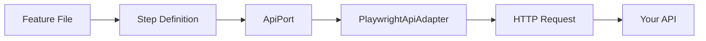

# API Testing Guide

Comprehensive guide to testing HTTP APIs with @kata/stack-tests.

## Overview

API testing validates your HTTP endpoints without browser overhead. Use `@api` tagged steps for fast, reliable backend testing.



## Basic Requests

### GET Requests

```gherkin
@api
Scenario: Fetch a resource
  When I GET "/users/1"
  Then the response status should be 200
  And the response should be a JSON object
```

### POST Requests

```gherkin
@api
Scenario: Create a resource
  When I POST "/users" with JSON body:
    """
    {
      "email": "new@example.com",
      "name": "New User"
    }
    """
  Then the response status should be 201
```

### PATCH Requests

```gherkin
@api
Scenario: Update a resource
  When I PATCH "/users/1" with JSON body:
    """
    {
      "name": "Updated Name"
    }
    """
  Then the response status should be 200
```

### PUT Requests

```gherkin
@api
Scenario: Replace a resource
  When I PUT "/users/1" with JSON body:
    """
    {
      "email": "replaced@example.com",
      "name": "Replaced User"
    }
    """
  Then the response status should be 200
```

### DELETE Requests

```gherkin
@api
Scenario: Delete a resource
  When I DELETE "/users/1"
  Then the response status should be 204
```

## Authentication

### Admin Authentication

```gherkin
@api
Scenario: Admin operation
  Given I am authenticated as an admin via API
  When I POST "/admin/users" with JSON body:
    """
    { "email": "admin-created@example.com" }
    """
  Then the response status should be 201
```

### User Authentication

```gherkin
@api
Scenario: User operation
  Given I am authenticated as a user via API
  When I GET "/profile"
  Then the response status should be 200
```

### Custom Token

```gherkin
@api
Scenario: Use specific token
  Given I set variable "token" to "eyJhbG..."
  Given I set bearer token from variable "token"
  When I GET "/protected"
  Then the response status should be 200
```

### Custom Headers

```gherkin
@api
Scenario: Custom authentication
  Given I set header "X-API-Key" to "my-api-key"
  When I GET "/api-key-protected"
  Then the response status should be 200
```

## Response Assertions

### Status Codes

```gherkin
Then the response status should be 200
Then the response status should be 201
Then the response status should be 204
Then the response status should be 400
Then the response status should be 404
```

### Response Type

```gherkin
Then the response should be a JSON array
Then the response should be a JSON object
```

### Value Assertions

```gherkin
# Direct value
Then the value at "email" should equal "test@example.com"

# Nested path
Then the value at "user.profile.name" should equal "John"

# Array access
Then the value at "items[0].id" should equal "1"
Then the value at "data[0].attributes.title" should equal "First Item"
```

### Variable Comparison

```gherkin
Given I set variable "expectedEmail" to "test@example.com"
Then the value at "email" should equal "{expectedEmail}"
```

## Variable Management

### Storing Response Values

```gherkin
@api
Scenario: Store and reuse values
  When I POST "/users" with JSON body:
    """
    { "email": "test@example.com" }
    """
  Then the response status should be 201
  And I store the value at "id" as "userId"
  And I store the value at "email" as "userEmail"
  
  When I GET "/users/{userId}"
  Then the response status should be 200
  And the value at "email" should equal "{userEmail}"
```

### Generated Data

```gherkin
@api
Scenario: Unique test data
  Given I generate a UUID and store as "uniqueId"
  Given I set variable "email" to "user-{uniqueId}@test.com"
  
  When I POST "/users" with JSON body:
    """
    { "email": "{email}" }
    """
  Then the response status should be 201
```

### Path Variables

```gherkin
@api
Scenario: Dynamic paths
  Given I set variable "teamId" to "team-123"
  Given I set variable "memberId" to "member-456"
  
  When I GET "/teams/{teamId}/members/{memberId}"
  Then the response status should be 200
```

## Cleanup

### Manual Cleanup Registration

```gherkin
@api
Scenario: Create with cleanup
  Given I am authenticated as an admin via API
  When I POST "/users" with JSON body:
    """
    { "email": "temp@example.com" }
    """
  Then I store the value at "id" as "userId"
  Given I register cleanup DELETE "/users/{userId}"
```

### Automatic Cleanup

The DefaultCleanupAdapter auto-registers cleanup based on variable names:

| Variable Pattern | Cleanup Path |
|-----------------|--------------|
| `userId`, `user*` | `/admin/users/{id}` |
| `teamId`, `team*` | `/admin/teams/{id}` |
| `workspaceId` | `/admin/workspaces/{id}` |

### Skip Cleanup (Debugging)

```gherkin
@api
Scenario: Debug without cleanup
  Given I disable cleanup
  When I POST "/users" with JSON body: ...
  # Resource remains after test for inspection
```

## Testing Patterns

### CRUD Operations

```gherkin
@api
Feature: User CRUD

  Background:
    Given I am authenticated as an admin via API

  Scenario: Create, Read, Update, Delete
    # Create
    When I POST "/users" with JSON body:
      """
      { "email": "crud@example.com", "name": "CRUD User" }
      """
    Then the response status should be 201
    And I store the value at "id" as "userId"
    
    # Read
    When I GET "/users/{userId}"
    Then the response status should be 200
    And the value at "email" should equal "crud@example.com"
    
    # Update
    When I PATCH "/users/{userId}" with JSON body:
      """
      { "name": "Updated User" }
      """
    Then the response status should be 200
    And the value at "name" should equal "Updated User"
    
    # Delete
    When I DELETE "/users/{userId}"
    Then the response status should be 204
```

### List and Filter

```gherkin
@api
Scenario: List with filters
  When I GET "/users?role=admin&status=active"
  Then the response status should be 200
  And the response should be a JSON array
```

### Pagination

```gherkin
@api
Scenario: Paginated results
  When I GET "/users?page=1&limit=10"
  Then the response status should be 200
  And the value at "meta.page" should equal "1"
  And the value at "meta.limit" should equal "10"
```

### Error Handling

```gherkin
@api
Scenario: Handle not found
  When I GET "/users/nonexistent"
  Then the response status should be 404

@api
Scenario: Handle validation error
  When I POST "/users" with JSON body:
    """
    { "email": "invalid-email" }
    """
  Then the response status should be 400
```

### Scenario Outline

```gherkin
@api
Scenario Outline: Create users with different roles
  Given I am authenticated as an admin via API
  When I POST "/users" with JSON body:
    """
    { "email": "<email>", "role": "<role>" }
    """
  Then the response status should be 201
  And the value at "role" should equal "<role>"

  Examples:
    | email              | role   |
    | admin@test.com     | admin  |
    | member@test.com    | member |
    | guest@test.com     | guest  |
```

## Environment Configuration

### Required Variables

```bash
# .env
API_BASE_URL=http://localhost:4000
API_AUTH_LOGIN_PATH=/auth/login

DEFAULT_ADMIN_USERNAME=admin@example.com
DEFAULT_ADMIN_PASSWORD=admin123

DEFAULT_USER_USERNAME=user@example.com
DEFAULT_USER_PASSWORD=user123
```

### Multiple Environments

```bash
# .env.staging
API_BASE_URL=https://api.staging.example.com

# .env.production
API_BASE_URL=https://api.example.com
```

```bash
# Run with specific env
ENV_FILE=.env.staging npm test
```

## Best Practices

### Use Backgrounds for Setup

```gherkin
@api
Feature: User API

  Background:
    Given I am authenticated as an admin via API
    # Runs before each scenario
```

### Isolate Test Data

```gherkin
@api
Scenario: Isolated data
  Given I generate a UUID and store as "testId"
  Given I set variable "email" to "test-{testId}@example.com"
  # Unique data prevents conflicts
```

### Keep Scenarios Independent

```gherkin
# Good - self-contained
@api
Scenario: Create and verify user
  Given I am authenticated as admin
  When I POST "/users" ...
  Then I store the value at "id" as "userId"
  When I GET "/users/{userId}"
  Then the response status should be 200

# Avoid - depends on other scenarios
@api
Scenario: Verify user from previous test
  When I GET "/users/{userId}"  # Where did userId come from?
```

### Meaningful Variable Names

```gherkin
# Good
Then I store the value at "id" as "createdUserId"
Then I store the value at "token" as "adminAccessToken"

# Avoid
Then I store the value at "id" as "id"
Then I store the value at "token" as "t"
```

## Debugging

### Inspect Response

Add custom steps to log responses:

```typescript
Then('I log the response', async ({ world }) => {
  console.log('Status:', world.lastStatus);
  console.log('Body:', JSON.stringify(world.lastJson, null, 2));
});
```

### Debug Mode

```bash
# Run with debug output
DEBUG=pw:api npm test
```

## Related Topics

- [API Steps Reference](../reference/steps/api-steps.md) - Complete step reference
- [World State](../concepts/world-state.md) - Variable management
- [Hybrid Testing](./hybrid-testing.md) - Combine with UI tests
