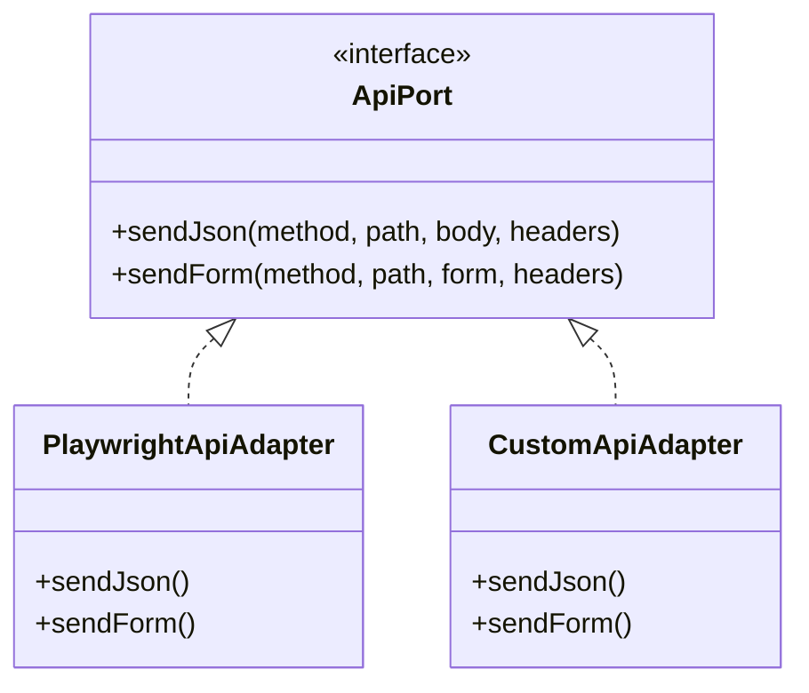

# Custom Adapters Guide

Create custom adapters to extend or replace default implementations.

## Overview

Adapters implement port interfaces, allowing you to:
- Use different HTTP clients (Axios, fetch, etc.)
- Integrate with custom auth systems
- Add logging, metrics, or retry logic
- Mock responses for testing



## When to Create Custom Adapters

| Scenario | Solution |
|----------|----------|
| Different HTTP client | Custom `ApiPort` adapter |
| Custom auth flow | Custom `AuthPort` adapter |
| Custom cleanup rules | Custom `CleanupPort` adapter |
| Different browser automation | Custom `UiPort` adapter |
| Different terminal framework | Custom `TuiPort` adapter |

## Creating an API Adapter

### Implement the Interface

```typescript
// adapters/axios-api.adapter.ts
import type { ApiPort, ApiMethod, ApiResult } from '@kata/stack-tests';
import axios, { AxiosInstance } from 'axios';

export class AxiosApiAdapter implements ApiPort {
  private client: AxiosInstance;

  constructor(baseURL: string) {
    this.client = axios.create({
      baseURL,
      timeout: 30000,
    });
  }

  async sendJson(
    method: ApiMethod,
    path: string,
    body?: unknown,
    headers?: Record<string, string>
  ): Promise<ApiResult> {
    try {
      const response = await this.client.request({
        method,
        url: path,
        data: body,
        headers: {
          'Content-Type': 'application/json',
          ...headers,
        },
      });

      return {
        status: response.status,
        text: JSON.stringify(response.data),
        json: response.data,
        headers: response.headers as Record<string, string>,
        contentType: response.headers['content-type'],
        response: response as any, // Adapter-specific
      };
    } catch (error: any) {
      if (error.response) {
        return {
          status: error.response.status,
          text: JSON.stringify(error.response.data),
          json: error.response.data,
          headers: error.response.headers,
          contentType: error.response.headers['content-type'],
          response: error.response,
        };
      }
      throw error;
    }
  }

  async sendForm(
    method: 'POST' | 'PUT' | 'PATCH',
    path: string,
    form: Record<string, string>,
    headers?: Record<string, string>
  ): Promise<ApiResult> {
    const formData = new URLSearchParams(form).toString();
    
    return this.sendJson(method, path, formData, {
      'Content-Type': 'application/x-www-form-urlencoded',
      ...headers,
    });
  }
}
```

### Register the Adapter

```typescript
// features/steps/fixtures.ts
import { createBddTest } from '@kata/stack-tests';
import { AxiosApiAdapter } from './adapters/axios-api.adapter';

export const test = createBddTest({
  createApi: () => new AxiosApiAdapter(process.env.API_BASE_URL!),
});
```

## Creating an Auth Adapter

### Custom Auth Flow

```typescript
// adapters/oauth-auth.adapter.ts
import type { AuthPort, ApiPort, UiPort, World } from '@kata/stack-tests';

export class OAuthAuthAdapter implements AuthPort {
  constructor(
    private api: ApiPort,
    private ui: UiPort,
    private config: {
      clientId: string;
      clientSecret: string;
      tokenUrl: string;
    }
  ) {}

  async apiLoginAsAdmin(world: World): Promise<void> {
    const result = await this.api.sendForm('POST', this.config.tokenUrl, {
      grant_type: 'client_credentials',
      client_id: this.config.clientId,
      client_secret: this.config.clientSecret,
      scope: 'admin',
    });

    if (result.status !== 200) {
      throw new Error(`OAuth login failed: ${result.status}`);
    }

    const token = (result.json as any).access_token;
    world.headers['Authorization'] = `Bearer ${token}`;
  }

  async apiLoginAsUser(world: World): Promise<void> {
    const result = await this.api.sendForm('POST', this.config.tokenUrl, {
      grant_type: 'password',
      client_id: this.config.clientId,
      username: process.env.DEFAULT_USER_USERNAME!,
      password: process.env.DEFAULT_USER_PASSWORD!,
    });

    if (result.status !== 200) {
      throw new Error(`OAuth login failed: ${result.status}`);
    }

    const token = (result.json as any).access_token;
    world.headers['Authorization'] = `Bearer ${token}`;
  }

  apiSetBearer(world: World, token: string): void {
    world.headers['Authorization'] = `Bearer ${token}`;
  }

  async uiLoginAsAdmin(world: World): Promise<void> {
    await this.ui.goto('/login');
    await this.ui.fillLabel('Email', process.env.DEFAULT_ADMIN_USERNAME!);
    await this.ui.fillLabel('Password', process.env.DEFAULT_ADMIN_PASSWORD!);
    await this.ui.clickButton('Sign In');
  }

  async uiLoginAsUser(world: World): Promise<void> {
    await this.ui.goto('/login');
    await this.ui.fillLabel('Email', process.env.DEFAULT_USER_USERNAME!);
    await this.ui.fillLabel('Password', process.env.DEFAULT_USER_PASSWORD!);
    await this.ui.clickButton('Sign In');
  }
}
```

### Register Auth Adapter

```typescript
import { OAuthAuthAdapter } from './adapters/oauth-auth.adapter';

export const test = createBddTest({
  createAuth: ({ api, ui }) => new OAuthAuthAdapter(api, ui, {
    clientId: process.env.OAUTH_CLIENT_ID!,
    clientSecret: process.env.OAUTH_CLIENT_SECRET!,
    tokenUrl: '/oauth/token',
  }),
});
```

## Creating a Cleanup Adapter

### Custom Cleanup Rules

```typescript
// adapters/custom-cleanup.adapter.ts
import type { CleanupPort, World } from '@kata/stack-tests';
import { registerCleanup } from '@kata/stack-tests';

type CleanupRule = {
  varMatch: string | RegExp;
  method: 'DELETE' | 'POST' | 'PATCH' | 'PUT';
  path: string;
};

export class CustomCleanupAdapter implements CleanupPort {
  private rules: CleanupRule[];

  constructor(rules: CleanupRule[]) {
    this.rules = rules;
  }

  registerFromVar(world: World, varName: string, id: unknown): void {
    const idStr = String(id);
    
    for (const rule of this.rules) {
      const matches = typeof rule.varMatch === 'string'
        ? varName.toLowerCase().includes(rule.varMatch.toLowerCase())
        : rule.varMatch.test(varName);

      if (matches) {
        const path = rule.path.replace('{id}', idStr);
        registerCleanup(world, { method: rule.method, path });
        return;
      }
    }

    console.warn(`No cleanup rule found for variable: ${varName}`);
  }
}
```

### Register Cleanup Adapter

```typescript
import { CustomCleanupAdapter } from './adapters/custom-cleanup.adapter';

export const test = createBddTest({
  createCleanup: () => new CustomCleanupAdapter([
    { varMatch: 'user', method: 'DELETE', path: '/api/users/{id}' },
    { varMatch: 'order', method: 'DELETE', path: '/api/orders/{id}' },
    { varMatch: 'product', method: 'DELETE', path: '/api/products/{id}' },
    { varMatch: /^team/, method: 'DELETE', path: '/api/teams/{id}' },
  ]),
});
```

## Adapter with Logging

### Logging Wrapper

```typescript
// adapters/logging-api.adapter.ts
import type { ApiPort, ApiMethod, ApiResult } from '@kata/stack-tests';

export class LoggingApiAdapter implements ApiPort {
  constructor(private delegate: ApiPort) {}

  async sendJson(
    method: ApiMethod,
    path: string,
    body?: unknown,
    headers?: Record<string, string>
  ): Promise<ApiResult> {
    console.log(`[API] ${method} ${path}`);
    if (body) {
      console.log(`[API] Body:`, JSON.stringify(body, null, 2));
    }

    const start = Date.now();
    const result = await this.delegate.sendJson(method, path, body, headers);
    const duration = Date.now() - start;

    console.log(`[API] ${result.status} (${duration}ms)`);
    return result;
  }

  async sendForm(
    method: 'POST' | 'PUT' | 'PATCH',
    path: string,
    form: Record<string, string>,
    headers?: Record<string, string>
  ): Promise<ApiResult> {
    console.log(`[API] ${method} ${path} (form)`);
    
    const start = Date.now();
    const result = await this.delegate.sendForm(method, path, form, headers);
    const duration = Date.now() - start;

    console.log(`[API] ${result.status} (${duration}ms)`);
    return result;
  }
}
```

### Use Logging Wrapper

```typescript
import { PlaywrightApiAdapter } from '@kata/stack-tests';
import { LoggingApiAdapter } from './adapters/logging-api.adapter';

export const test = createBddTest({
  createApi: ({ apiRequest }) => {
    const baseAdapter = new PlaywrightApiAdapter(apiRequest);
    return process.env.DEBUG 
      ? new LoggingApiAdapter(baseAdapter)
      : baseAdapter;
  },
});
```

## Adapter with Retry Logic

```typescript
// adapters/retry-api.adapter.ts
import type { ApiPort, ApiMethod, ApiResult } from '@kata/stack-tests';

export class RetryApiAdapter implements ApiPort {
  constructor(
    private delegate: ApiPort,
    private maxRetries: number = 3,
    private retryDelay: number = 1000
  ) {}

  async sendJson(
    method: ApiMethod,
    path: string,
    body?: unknown,
    headers?: Record<string, string>
  ): Promise<ApiResult> {
    let lastError: Error | undefined;
    
    for (let attempt = 1; attempt <= this.maxRetries; attempt++) {
      try {
        const result = await this.delegate.sendJson(method, path, body, headers);
        
        // Retry on server errors
        if (result.status >= 500 && attempt < this.maxRetries) {
          console.warn(`[Retry] Attempt ${attempt} failed with ${result.status}`);
          await this.delay(this.retryDelay * attempt);
          continue;
        }
        
        return result;
      } catch (error) {
        lastError = error as Error;
        console.warn(`[Retry] Attempt ${attempt} failed:`, error);
        
        if (attempt < this.maxRetries) {
          await this.delay(this.retryDelay * attempt);
        }
      }
    }
    
    throw lastError || new Error('All retry attempts failed');
  }

  async sendForm(
    method: 'POST' | 'PUT' | 'PATCH',
    path: string,
    form: Record<string, string>,
    headers?: Record<string, string>
  ): Promise<ApiResult> {
    // Similar retry logic...
    return this.delegate.sendForm(method, path, form, headers);
  }

  private delay(ms: number): Promise<void> {
    return new Promise(resolve => setTimeout(resolve, ms));
  }
}
```

## Mock Adapter for Testing

```typescript
// adapters/mock-api.adapter.ts
import type { ApiPort, ApiMethod, ApiResult } from '@kata/stack-tests';

type MockResponse = {
  status: number;
  json: unknown;
};

export class MockApiAdapter implements ApiPort {
  private mocks: Map<string, MockResponse> = new Map();

  mock(method: ApiMethod, path: string, response: MockResponse): void {
    this.mocks.set(`${method}:${path}`, response);
  }

  async sendJson(
    method: ApiMethod,
    path: string,
    body?: unknown,
    headers?: Record<string, string>
  ): Promise<ApiResult> {
    const key = `${method}:${path}`;
    const mock = this.mocks.get(key);
    
    if (!mock) {
      throw new Error(`No mock defined for ${key}`);
    }

    return {
      status: mock.status,
      text: JSON.stringify(mock.json),
      json: mock.json,
      headers: {},
      contentType: 'application/json',
      response: {} as any,
    };
  }

  async sendForm(): Promise<ApiResult> {
    throw new Error('Not implemented in mock');
  }
}
```

## Testing Your Adapter

```typescript
// adapters/__tests__/custom-api.adapter.test.ts
import { describe, it, expect } from 'vitest';
import { CustomApiAdapter } from '../custom-api.adapter';

describe('CustomApiAdapter', () => {
  it('should send JSON request', async () => {
    const adapter = new CustomApiAdapter('http://localhost:4000');
    
    const result = await adapter.sendJson('GET', '/health');
    
    expect(result.status).toBe(200);
  });

  it('should handle errors', async () => {
    const adapter = new CustomApiAdapter('http://localhost:4000');
    
    const result = await adapter.sendJson('GET', '/not-found');
    
    expect(result.status).toBe(404);
  });
});
```

## Best Practices

### Keep Adapters Focused

```typescript
// Good - single responsibility
class ApiAdapter implements ApiPort { /* HTTP only */ }
class AuthAdapter implements AuthPort { /* Auth only */ }

// Avoid - multiple responsibilities
class EverythingAdapter implements ApiPort, AuthPort, CleanupPort { }
```

### Use Composition

```typescript
// Good - compose behaviors
const api = new RetryApiAdapter(
  new LoggingApiAdapter(
    new PlaywrightApiAdapter(request)
  )
);
```

### Handle Errors Gracefully

```typescript
async sendJson(...): Promise<ApiResult> {
  try {
    // ... implementation
  } catch (error) {
    // Return error result instead of throwing
    return {
      status: 0,
      text: error.message,
      json: { error: error.message },
      headers: {},
    };
  }
}
```

## Related Topics

- [Architecture](../concepts/architecture.md) - Ports and adapters pattern
- [Adding Adapters](../contributing/adding-adapters.md) - Contributing adapters
- [Ports Reference](../reference/api/ports.md) - Port interfaces
