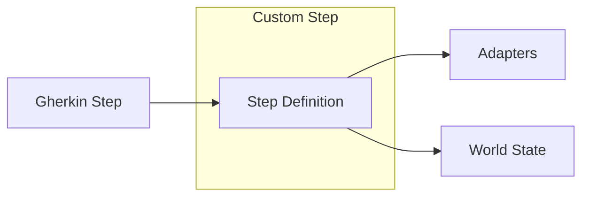

# Custom Steps Guide

Create domain-specific step definitions to extend the framework.

## Overview

Custom steps let you encapsulate domain logic in reusable Gherkin patterns.



## Creating Custom Steps

### Basic Step File

```typescript
// features/steps/custom/user.steps.ts
import { createBdd } from 'playwright-bdd';
import { test } from '../fixtures';
import { interpolate } from '@kata/stack-tests';

const { Given, When, Then } = createBdd(test);

Given('a user exists with email {string}', { tags: '@api' }, 
  async ({ api, world }, email: string) => {
    const resolvedEmail = interpolate(email, world.vars);
    
    const result = await api.sendJson('POST', '/admin/users', {
      email: resolvedEmail,
      password: 'TestPassword123',
      role: 'member',
    }, world.headers);

    if (result.status !== 201) {
      throw new Error(`Failed to create user: ${result.status}`);
    }

    const userId = (result.json as any).id;
    world.vars['userId'] = String(userId);
    world.vars['userEmail'] = resolvedEmail;
  }
);

When('the user logs in', { tags: '@ui' },
  async ({ ui, world }) => {
    await ui.goto('/login');
    await ui.fillLabel('Email', world.vars['userEmail']);
    await ui.fillLabel('Password', 'TestPassword123');
    await ui.clickButton('Sign In');
  }
);

Then('the user should see their dashboard', { tags: '@ui' },
  async ({ ui }) => {
    await ui.expectText('Dashboard');
    await ui.expectUrlContains('/dashboard');
  }
);
```

### Register Custom Steps

```typescript
// features/steps/steps.ts
import { test } from './fixtures';
import { registerApiSteps, registerUiSteps } from '@kata/stack-tests/steps';

// Register built-in steps
registerApiSteps(test);
registerUiSteps(test);

// Import custom steps (auto-registers via createBdd)
import './custom/user.steps';
import './custom/order.steps';
import './custom/payment.steps';

export { test };
```

## Step Patterns

### Parameterized Steps

```typescript
// Single parameter
Given('I am on the {string} page', async ({ ui }, pageName) => {
  const routes: Record<string, string> = {
    'login': '/login',
    'home': '/',
    'dashboard': '/dashboard',
    'settings': '/settings',
  };
  await ui.goto(routes[pageName] || `/${pageName}`);
});

// Multiple parameters
When('I create a {string} named {string}', async ({ api, world }, type, name) => {
  await api.sendJson('POST', `/admin/${type}s`, { name }, world.headers);
});

// Integer parameter
Then('I should see {int} items', async ({ ui }, count) => {
  // count is a number
});

// Float parameter
Then('the total should be {float}', async ({ world }, total) => {
  const actualTotal = (world.lastJson as any).total;
  expect(actualTotal).toBeCloseTo(total, 2);
});
```

### Doc String Steps

```typescript
When('I create a user with details:', async ({ api, world }, docString) => {
  const details = JSON.parse(docString);
  const interpolatedDetails = Object.fromEntries(
    Object.entries(details).map(([k, v]) => [k, interpolate(String(v), world.vars)])
  );
  
  await api.sendJson('POST', '/users', interpolatedDetails, world.headers);
});
```

Usage:
```gherkin
When I create a user with details:
  """
  {
    "email": "{uniqueEmail}",
    "name": "Test User",
    "role": "member"
  }
  """
```

### Data Table Steps

```typescript
When('I create users:', async ({ api, world }, dataTable) => {
  const rows = dataTable.hashes();
  
  for (const row of rows) {
    await api.sendJson('POST', '/users', {
      email: interpolate(row.email, world.vars),
      name: interpolate(row.name, world.vars),
      role: row.role,
    }, world.headers);
  }
});
```

Usage:
```gherkin
When I create users:
  | email              | name      | role   |
  | user1@test.com     | User One  | member |
  | user2@test.com     | User Two  | admin  |
```

### Optional Parameters

```typescript
// Using regex for optional parts
Given(/^I am on the homepage( as (\w+))?$/, async ({ ui, auth, world }, _, role) => {
  if (role) {
    if (role === 'admin') {
      await auth.uiLoginAsAdmin(world);
    } else {
      await auth.uiLoginAsUser(world);
    }
  }
  await ui.goto('/');
});
```

Usage:
```gherkin
Given I am on the homepage
Given I am on the homepage as admin
Given I am on the homepage as user
```

## Tagging Steps

### Project Tags

```typescript
// Only available in @api scenarios
When('I call the API', { tags: '@api' }, async ({ api }) => {
  // ...
});

// Only available in @ui scenarios
When('I click the submit button', { tags: '@ui' }, async ({ ui }) => {
  // ...
});

// Available in multiple project types
When('I verify the data', { tags: '@api or @hybrid' }, async ({ api, world }) => {
  // ...
});
```

### No Tag (Universal)

```typescript
// Available in all scenarios
Given('I set the test context', async ({ world }) => {
  world.vars['testContext'] = 'active';
});
```

## Using World State

### Access Variables

```typescript
When('I use the stored user', async ({ api, world }) => {
  const userId = world.vars['userId'];
  if (!userId) {
    throw new Error('userId not set');
  }
  
  await api.sendJson('GET', `/users/${userId}`, undefined, world.headers);
});
```

### Store Variables

```typescript
Then('I remember the response ID as {string}', async ({ world }, varName) => {
  const id = (world.lastJson as any).id;
  world.vars[varName] = String(id);
});
```

### Use Response Data

```typescript
Then('the response should have a valid user', async ({ world }) => {
  const json = world.lastJson as any;
  
  expect(json).toBeDefined();
  expect(json.id).toBeDefined();
  expect(json.email).toMatch(/@/);
});
```

## Composing Steps

### Reuse Existing Adapters

```typescript
import { interpolate, selectPath, registerCleanup } from '@kata/stack-tests';

When('I create and verify a user', { tags: '@api' }, 
  async ({ api, world }) => {
    // Create
    const email = `test-${Date.now()}@example.com`;
    const createResult = await api.sendJson('POST', '/users', {
      email,
      password: 'Test123',
    }, world.headers);

    expect(createResult.status).toBe(201);
    const userId = selectPath(createResult.json, 'id');
    
    // Store for later use
    world.vars['createdUserId'] = String(userId);
    
    // Register cleanup
    registerCleanup(world, { method: 'DELETE', path: `/users/${userId}` });

    // Verify
    const getResult = await api.sendJson('GET', `/users/${userId}`, undefined, world.headers);
    expect(getResult.status).toBe(200);
    expect(selectPath(getResult.json, 'email')).toBe(email);
  }
);
```

### Call Multiple Adapters

```typescript
When('I create a user and verify in UI', { tags: '@hybrid' },
  async ({ api, ui, world }) => {
    // API: Create user
    const result = await api.sendJson('POST', '/users', {
      email: 'newuser@test.com',
      name: 'New User',
    }, world.headers);
    
    const userId = (result.json as any).id;
    world.vars['userId'] = String(userId);
    
    // UI: Verify user appears
    await ui.goto('/admin/users');
    await ui.expectText('newuser@test.com');
  }
);
```

## Domain-Specific Steps

### E-commerce Example

```typescript
// features/steps/custom/ecommerce.steps.ts

Given('a product {string} exists with price {float}', 
  async ({ api, world }, name, price) => {
    const result = await api.sendJson('POST', '/products', {
      name,
      price,
      stock: 100,
    }, world.headers);
    
    world.vars['productId'] = String((result.json as any).id);
    world.vars['productName'] = name;
    world.vars['productPrice'] = String(price);
  }
);

When('I add the product to cart', { tags: '@ui' },
  async ({ ui, world }) => {
    await ui.goto(`/products/${world.vars['productId']}`);
    await ui.clickButton('Add to Cart');
  }
);

When('I checkout with payment method {string}',
  async ({ ui, world }, paymentMethod) => {
    await ui.goto('/checkout');
    await ui.fillLabel('Card Number', '4242424242424242');
    await ui.fillLabel('Expiry', '12/25');
    await ui.fillLabel('CVV', '123');
    await ui.clickButton('Pay Now');
  }
);

Then('the order should be confirmed', { tags: '@ui' },
  async ({ ui, world }) => {
    await ui.expectText('Order Confirmed');
    // Extract order ID from page
  }
);

Then('the order total should be {float}', 
  async ({ api, world }, expectedTotal) => {
    const orderId = world.vars['orderId'];
    const result = await api.sendJson('GET', `/orders/${orderId}`, undefined, world.headers);
    
    const actualTotal = (result.json as any).total;
    expect(actualTotal).toBeCloseTo(expectedTotal, 2);
  }
);
```

### Usage

```gherkin
@hybrid
Feature: Checkout

  Scenario: Purchase a product
    Given I am authenticated as an admin via API
    And a product "Test Widget" exists with price 29.99
    
    When I add the product to cart
    And I checkout with payment method "card"
    
    Then the order should be confirmed
    And the order total should be 29.99
```

## Testing Custom Steps

### Unit Test Steps

```typescript
// features/steps/custom/__tests__/user.steps.test.ts
import { describe, it, expect, vi } from 'vitest';

describe('User Steps', () => {
  it('should create user with email', async () => {
    const mockApi = {
      sendJson: vi.fn().mockResolvedValue({
        status: 201,
        json: { id: '123' },
      }),
    };
    const world = { vars: {}, headers: {} };

    // Call step logic directly
    await createUser(mockApi, world, 'test@example.com');

    expect(mockApi.sendJson).toHaveBeenCalledWith(
      'POST',
      '/admin/users',
      expect.objectContaining({ email: 'test@example.com' }),
      {}
    );
    expect(world.vars['userId']).toBe('123');
  });
});
```

## Best Practices

### Keep Steps Atomic

```typescript
// Good - single responsibility
Given('a user exists', async () => { /* create user */ });
When('the user logs in', async () => { /* login */ });
Then('the user sees dashboard', async () => { /* verify */ });

// Avoid - too much in one step
Given('a logged in user on dashboard', async () => {
  /* create user, login, navigate, verify - too much! */
});
```

### Use Descriptive Patterns

```typescript
// Good - clear intent
Given('a premium user with subscription {string}', ...);
When('the user upgrades to {string} plan', ...);
Then('the billing shows {float} per month', ...);

// Avoid - vague
Given('setup user', ...);
When('do action', ...);
Then('check result', ...);
```

### Handle Errors Gracefully

```typescript
When('I create a user', async ({ api, world }) => {
  const result = await api.sendJson('POST', '/users', { ... }, world.headers);
  
  if (result.status !== 201) {
    throw new Error(
      `Failed to create user: ${result.status}\n` +
      `Response: ${result.text}`
    );
  }
});
```

### Document Complex Steps

```typescript
/**
 * Creates a complete test scenario with user, team, and project.
 * 
 * Sets variables:
 * - userId: Created user ID
 * - teamId: Created team ID
 * - projectId: Created project ID
 * 
 * @param teamName - Name of the team to create
 */
Given('a complete project environment for team {string}',
  async ({ api, world }, teamName) => {
    // ... implementation
  }
);
```

## Related Topics

- [Step Reference](../reference/steps/api-steps.md) - Built-in steps
- [World State](../concepts/world-state.md) - State management
- [Adding Steps](../contributing/adding-steps.md) - Contributing steps
