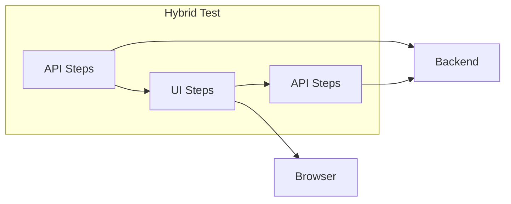

# Hybrid Testing Guide

Combining API and UI testing for comprehensive end-to-end coverage.

## Overview

Hybrid tests use both API and UI steps in the same scenario, enabling powerful testing patterns like API setup with UI verification.



## When to Use Hybrid Tests

| Use Case | Example |
|----------|---------|
| **API Setup** | Create data via API, verify in UI |
| **UI Actions, API Verification** | Submit form in UI, verify via API |
| **Complex Workflows** | Authentication via API, then UI navigation |
| **Performance** | Bulk setup via API, test UI with pre-existing data |

## Configuration

### Tag Your Scenarios

```gherkin
@hybrid
Feature: End-to-End Workflows
```

### Playwright Config

```typescript
const hybridBdd = defineBddProject({
  name: 'hybrid',
  features: 'features/hybrid/**/*.feature',
  steps: 'features/steps/**/*.ts',
  tags: '@hybrid',
});
```

## Common Patterns

### API Setup, UI Verify

Create test data via API (fast), verify it appears in UI:

```gherkin
@hybrid
Feature: User Management

  Scenario: Create user via API, verify in UI
    # Setup via API
    Given I am authenticated as an admin via API
    When I POST "/admin/users" with JSON body:
      """
      {
        "email": "newuser@example.com",
        "name": "New User",
        "role": "member"
      }
      """
    Then the response status should be 201
    And I store the value at "id" as "userId"
    And I store the value at "email" as "userEmail"
    
    # Verify in UI
    Given I navigate to "/admin/users"
    Then I should see text "{userEmail}"
    When I click the link "{userEmail}"
    Then I should see text "New User"
    And I should see text "member"
```

### UI Action, API Verify

Perform action in UI, verify via API:

```gherkin
@hybrid
Feature: Profile Update

  Scenario: Update profile in UI, verify via API
    # Login and update via UI
    Given I navigate to "/login"
    When I log in as user in UI
    And I navigate to "/profile"
    And I fill the field "Display Name" with "Updated Name"
    And I click the button "Save"
    Then I should see text "Profile saved"
    
    # Verify via API
    Given I am authenticated as a user via API
    When I GET "/profile"
    Then the response status should be 200
    And the value at "displayName" should equal "Updated Name"
```

### Authenticated UI via API Token

Skip UI login by setting auth via API:

```gherkin
@hybrid
Feature: Fast UI Tests

  Background:
    # Get auth token via API
    Given I am authenticated as an admin via API
    # Token is now available for UI requests

  Scenario: Access protected page
    Given I navigate to "/admin/dashboard"
    Then I should see text "Admin Dashboard"
```

### Bulk Setup, Single UI Test

Create multiple entities via API, test UI listing:

```gherkin
@hybrid
Feature: User List

  Scenario: Display multiple users
    Given I am authenticated as an admin via API
    
    # Create multiple users via API
    When I POST "/admin/users" with JSON body:
      """
      { "email": "user1@test.com", "name": "User One" }
      """
    Then the response status should be 201
    And I store the value at "id" as "user1Id"
    
    When I POST "/admin/users" with JSON body:
      """
      { "email": "user2@test.com", "name": "User Two" }
      """
    Then the response status should be 201
    And I store the value at "id" as "user2Id"
    
    When I POST "/admin/users" with JSON body:
      """
      { "email": "user3@test.com", "name": "User Three" }
      """
    Then the response status should be 201
    And I store the value at "id" as "user3Id"
    
    # Verify in UI
    Given I navigate to "/admin/users"
    Then I should see text "user1@test.com"
    And I should see text "user2@test.com"
    And I should see text "user3@test.com"
```

### Cleanup via API After UI Test

```gherkin
@hybrid
Feature: User Deletion

  Scenario: Delete user via UI, verify via API
    # Create user via API
    Given I am authenticated as an admin via API
    When I POST "/admin/users" with JSON body:
      """
      { "email": "todelete@test.com" }
      """
    Then I store the value at "id" as "userId"
    
    # Delete via UI
    Given I navigate to "/admin/users/{userId}"
    When I click the button "Delete"
    And I click the button "Confirm"
    Then I should see text "User deleted"
    
    # Verify deletion via API
    When I GET "/admin/users/{userId}"
    Then the response status should be 404
```

## Complete Workflow Example

```gherkin
@hybrid
Feature: Order Processing

  Scenario: Complete order workflow
    # 1. Setup: Create product via API
    Given I am authenticated as an admin via API
    When I POST "/admin/products" with JSON body:
      """
      {
        "name": "Test Product",
        "price": 29.99,
        "stock": 100
      }
      """
    Then the response status should be 201
    And I store the value at "id" as "productId"
    
    # 2. UI: Customer places order
    Given I navigate to "/products/{productId}"
    Then I should see text "Test Product"
    And I should see text "$29.99"
    When I click the button "Add to Cart"
    And I navigate to "/cart"
    And I click the button "Checkout"
    And I fill the field "Name" with "John Doe"
    And I fill the field "Address" with "123 Main St"
    And I click the button "Place Order"
    Then I should see text "Order Confirmed"
    
    # Extract order ID from URL
    When I save the current URL as "orderUrl"
    When I get a part of the URL based on "/orders/(\d+)" regular expression and save it as "orderId"
    
    # 3. Verify: Check order via API
    Given I am authenticated as an admin via API
    When I GET "/admin/orders/{orderId}"
    Then the response status should be 200
    And the value at "status" should equal "confirmed"
    And the value at "total" should equal "29.99"
    
    # 4. Admin action: Ship order via API
    When I PATCH "/admin/orders/{orderId}" with JSON body:
      """
      { "status": "shipped" }
      """
    Then the response status should be 200
    
    # 5. Verify: Customer sees shipped status in UI
    Given I navigate to "/orders/{orderId}"
    Then I should see text "Shipped"
```

## Variable Sharing

Variables set in API steps are available in UI steps and vice versa:

```gherkin
@hybrid
Scenario: Share variables across layers
  # Set via API response
  Given I am authenticated as an admin via API
  When I POST "/users" with JSON body: { "email": "test@example.com" }
  Then I store the value at "id" as "userId"
  
  # Use in UI
  Given I navigate to "/users/{userId}"
  Then I should see text "test@example.com"
  
  # Set manually
  Given I set variable "searchTerm" to "test"
  
  # Use in both
  When I GET "/search?q={searchTerm}"
  Given I navigate to "/search?q={searchTerm}"
```

## Authentication Strategies

### Strategy 1: API Auth, UI Uses Same Session

```gherkin
@hybrid
Scenario: Shared auth
  Given I am authenticated as an admin via API
  # Bearer token set in world.headers
  
  Given I navigate to "/dashboard"
  # If UI uses same auth mechanism, you're logged in
```

### Strategy 2: Separate Auth Per Layer

```gherkin
@hybrid
Scenario: Separate auth
  # API auth
  Given I am authenticated as an admin via API
  When I GET "/admin/stats"
  Then the response status should be 200
  
  # UI auth
  Given I navigate to "/login"
  When I log in as admin in UI
  Then I should see text "Dashboard"
```

### Strategy 3: Token Injection

```gherkin
@hybrid
Scenario: Inject API token to UI
  # Get token via API
  Given I am authenticated as an admin via API
  # Store token from auth step
  
  # Use token in UI (requires custom implementation)
  Given I inject auth token to browser
  Given I navigate to "/dashboard"
  Then I should see text "Admin Dashboard"
```

## Cleanup Considerations

Cleanup registered in API steps still works:

```gherkin
@hybrid
Scenario: Cleanup works across layers
  # Create via API
  Given I am authenticated as an admin via API
  When I POST "/users" with JSON body: { "email": "temp@test.com" }
  Then I store the value at "id" as "userId"
  Given I register cleanup DELETE "/users/{userId}"
  
  # Test via UI
  Given I navigate to "/users/{userId}"
  Then I should see text "temp@test.com"
  
  # Cleanup runs after test via API (DELETE /users/{userId})
```

## Best Practices

### Use API for Setup/Teardown

```gherkin
# Good - fast setup
@hybrid
Background:
  Given I am authenticated as an admin via API
  When I POST "/reset-test-data" with JSON body: {}
```

### Test One Thing in UI

```gherkin
# Good - focused UI test
@hybrid
Scenario: Test the delete confirmation dialog
  # Setup via API
  Given I am authenticated as an admin via API
  When I POST "/users" with JSON body: { "email": "test@test.com" }
  Then I store the value at "id" as "userId"
  
  # Test only the dialog in UI
  Given I navigate to "/users/{userId}"
  When I click the button "Delete"
  Then I should see text "Are you sure?"
  When I click the button "Cancel"
  Then I should not see text "User deleted"
```

### Verify State Changes

```gherkin
# Good - verify API state matches UI action
@hybrid
Scenario: Verify form submission
  Given I navigate to "/settings"
  When I fill the field "Timezone" with "UTC"
  And I click the button "Save"
  Then I should see text "Settings saved"
  
  # Verify via API
  Given I am authenticated as a user via API
  When I GET "/settings"
  Then the value at "timezone" should equal "UTC"
```

## Troubleshooting

### Variable Not Found

Ensure variables are set before use:

```gherkin
# Wrong order
Given I navigate to "/users/{userId}"  # userId not set yet!
When I GET "/users"
Then I store the value at "[0].id" as "userId"

# Correct order
When I GET "/users"
Then I store the value at "[0].id" as "userId"
Given I navigate to "/users/{userId}"
```

### Auth Not Shared

API and UI may use different auth mechanisms. Use appropriate auth for each:

```gherkin
Given I am authenticated as an admin via API  # For API calls
When I log in as admin in UI                   # For browser session
```

## Related Topics

- [API Testing Guide](./api-testing.md) - API testing details
- [UI Testing Guide](./ui-testing.md) - UI testing details
- [World State](../concepts/world-state.md) - Variable sharing
