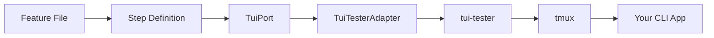

# TUI Testing Guide

Comprehensive guide to terminal user interface testing with @kata/stack-tests.

## Overview

TUI (Terminal User Interface) testing validates CLI applications and terminal-based interfaces using tmux-based simulation. Use `@tui` tagged steps for terminal testing.



## Prerequisites

### Install tmux

```bash
# macOS
brew install tmux

# Ubuntu/Debian
sudo apt-get install tmux

# Fedora
sudo dnf install tmux

# Verify
tmux -V
```

### Install tui-tester

```bash
npm install -D tui-tester
```

## Configuration

### Enable TUI in Fixtures

```typescript
// features/steps/fixtures.ts
import {
  createBddTest,
  TuiTesterAdapter,
} from '@kata/stack-tests';

export const test = createBddTest({
  createTui: () => new TuiTesterAdapter({
    command: ['node', 'dist/cli.js'],  // Your CLI command
    size: { cols: 100, rows: 30 },      // Terminal size
    debug: process.env.DEBUG === 'true',
    cwd: process.cwd(),                 // Working directory
  }),
});
```

### Register TUI Steps

```typescript
// features/steps/steps.ts
import { registerTuiSteps } from '@kata/stack-tests/steps';

registerTuiSteps(test);
```

### Add TUI Project

```typescript
// playwright.config.ts
const tuiBdd = defineBddProject({
  name: 'tui',
  features: 'features/tui/**/*.feature',
  steps: 'features/steps/**/*.ts',
  tags: '@tui',
});

export default defineConfig({
  projects: [apiBdd, uiBdd, tuiBdd],
});
```

## Basic Usage

### Start and Stop

```gherkin
@tui
Scenario: Basic TUI test
  Given I start the TUI application
  Then I should see "Welcome"
  When I stop the TUI application
```

### Typing Text

```gherkin
@tui
Scenario: Type commands
  Given I start the TUI application
  When I type "hello world"
  And I press enter
  Then I should see "You typed: hello world"
```

### Keyboard Input

```gherkin
@tui
Scenario: Keyboard navigation
  Given I start the TUI application
  When I press "down"
  And I press "down"
  And I press "enter"
  Then I should see "Option 2 selected"
```

## Input Steps

### Basic Typing

```gherkin
# Instant typing
When I type "command"

# Slow typing (50ms delay between characters)
When I type "command" slowly
```

### Key Presses

```gherkin
# Common keys
When I press enter
When I press tab
When I press escape

# Arrow keys
When I press "up"
When I press "down"
When I press "left"
When I press "right"

# Function keys
When I press "f1"
When I press "f12"

# Other keys
When I press "home"
When I press "end"
When I press "pageup"
When I press "pagedown"
When I press "backspace"
When I press "delete"
```

### Modifier Keys

```gherkin
# Ctrl combinations
When I press "c" with ctrl
When I press "s" with ctrl
When I press ctrl+c

# Alt combinations
When I press "f" with alt
When I press alt+f

# Shift combinations
When I press "tab" with shift
When I press shift+tab

# Multiple modifiers
When I press ctrl+shift+s
```

### Field Input

```gherkin
# Fill labeled field
When I fill the TUI field "Username" with "admin"
When I enter "password123" in the "Password" field
```

## Navigation

### Menu Navigation

```gherkin
@tui
Scenario: Navigate menu
  Given I start the TUI application
  When I navigate down 3 times
  And I press enter
  Then I should see "Settings"
  
  When I navigate up 2 times
  And I press enter
  Then I should see "Dashboard"
```

### Screen Navigation

```gherkin
@tui
Scenario: Navigate screens
  Given I start the TUI application
  When I navigate to "Settings" and select
  Then I should see "Configuration Options"
  When I go back
  Then I should see "Main Menu"
```

## Assertions

### Text Visibility

```gherkin
# Wait for text (with timeout)
Then I should see "Welcome"
Then I should see "Welcome" in the terminal
Then I should see text "Loading complete"

# Immediate check
Then the screen should contain "Menu"

# Negative assertion
Then I should not see "Error"
```

### Pattern Matching

```gherkin
Then the screen should match pattern "Version: \d+\.\d+\.\d+"
```

### Timed Assertions

```gherkin
# Wait with explicit timeout
When I wait for "Ready" for 10 seconds
```

### Line-Specific Assertions

```gherkin
# Check specific lines
Then line 1 should contain "Application Title"
Then the first line should contain "Title"
Then the last line should contain "Status: Ready"
```

### Multiple Text Assertions

```gherkin
Then I should see all of:
  | Welcome          |
  | Main Menu        |
  | Press ? for help |

Then I should not see any of:
  | Error      |
  | Exception  |
  | Failed     |
```

## Forms

### Fill Form

```gherkin
@tui
Scenario: Complete form
  Given I start the TUI application
  When I fill the form:
    | field    | value            |
    | Username | admin            |
    | Password | secret123        |
    | Email    | admin@example.com |
  And I submit the form
  Then I should see "Form submitted"
```

### Submit Methods

```gherkin
# Press Enter
When I submit the form

# Press Ctrl+S
When I submit the form with ctrl+s
```

## Menus and Dropdowns

### Select Menu Items

```gherkin
When I select "Settings"
When I select option "Preferences"
When I select menu item "Exit"
```

### Open Menu

```gherkin
When I open the menu
# Presses Alt+M
```

### Dropdowns

```gherkin
When I select from dropdown "Country" value "United States"
```

## Dialogs

### Confirmation Dialogs

```gherkin
# Confirm (types 'y' + Enter)
When I confirm the dialog

# Cancel (types 'n' + Enter)
When I cancel the dialog

# Dismiss (presses Escape)
When I dismiss the dialog
```

## Commands

### Execute CLI Commands

```gherkin
@tui
Scenario: Run commands
  Given I start the TUI application
  When I execute command "help"
  Then I should see "Available commands"
  
  When I run "list users"
  Then I should see "User List"
```

## Snapshots

### Take Snapshots

```gherkin
@tui
Scenario: Capture screen state
  Given I start the TUI application
  Then I take a snapshot named "main-menu"
```

### Compare Snapshots

```gherkin
@tui
Scenario: Verify screen layout
  Given I start the TUI application
  Then the screen should match snapshot "main-menu"
```

### Snapshot Storage

Configure snapshot directory:

```typescript
createTui: () => new TuiTesterAdapter({
  command: ['node', 'dist/cli.js'],
  snapshotDir: './snapshots/tui',
}),
```

## Screen Capture

### Capture for Debugging

```gherkin
When I capture the screen
# Stores in world.vars['lastScreenCapture']
```

### Print Screen

```gherkin
Then I print the screen
# Outputs to console
```

## Utility Steps

### Clear Screen

```gherkin
When I clear the terminal
```

### Resize Terminal

```gherkin
When I resize the terminal to 120x40
```

### Wait

```gherkin
When I wait 2 seconds
When I wait for "Loading..." for 30 seconds
```

## Complete Examples

### CLI Tool Test

```gherkin
@tui
Feature: CLI Tool

  Scenario: Help command
    Given I start the TUI application
    When I execute command "help"
    Then I should see "Usage:"
    And I should see "Commands:"
    And I should see all of:
      | init     |
      | build    |
      | deploy   |

  Scenario: Interactive mode
    Given I start the TUI application
    When I execute command "init"
    Then I should see "Project name:"
    When I type "my-project"
    And I press enter
    Then I should see "Template:"
    When I navigate down 2 times
    And I press enter
    Then I should see "Project created successfully"
```

### TUI Dashboard

```gherkin
@tui
Feature: Dashboard TUI

  Background:
    Given I start the TUI application
    And I should see "Login"

  Scenario: Login and navigate
    When I enter "admin" in the "Username" field
    And I press tab
    And I enter "secret" in the "Password" field
    And I submit the form
    Then I should see "Dashboard"
    And the screen should match snapshot "dashboard-home"

  Scenario: Navigate to settings
    When I enter "admin" in the "Username" field
    And I press tab
    And I enter "secret" in the "Password" field
    And I submit the form
    When I press "s"
    Then I should see "Settings"
    And I should see all of:
      | Theme      |
      | Language   |
      | Shortcuts  |
```

### Menu-Driven Application

```gherkin
@tui
Feature: Menu Application

  Scenario: Full menu navigation
    Given I start the TUI application
    Then I should see "Main Menu"
    
    # Navigate to Files
    When I navigate down 1 times
    And I press enter
    Then I should see "File Browser"
    
    # Go back
    When I go back
    Then I should see "Main Menu"
    
    # Navigate to Settings
    When I navigate down 3 times
    And I press enter
    Then I should see "Settings"
    
    # Change a setting
    When I select menu item "Theme"
    And I navigate down 2 times
    And I press enter
    Then I should see "Theme: Dark"
    
    # Exit
    When I quit the application
```

## Environment Configuration

```bash
# .env
DEBUG=false
```

Enable debug mode for troubleshooting:

```bash
DEBUG=true npm test -- --project=tui
```

## Best Practices

### Wait for Ready State

```gherkin
# Good - wait for application to be ready
Given I start the TUI application
And I should see "Ready"  # or specific prompt

# Avoid - no wait
Given I start the TUI application
When I type "command"  # might fail if not ready
```

### Use Meaningful Snapshots

```gherkin
# Good - descriptive names
Then the screen should match snapshot "login-form-empty"
Then the screen should match snapshot "login-form-error-invalid-password"

# Avoid - generic names
Then the screen should match snapshot "screen1"
```

### Test Keyboard Navigation

```gherkin
# Test both keyboard and menu navigation
Scenario: Keyboard navigation
  When I press "s"  # Shortcut for Settings
  Then I should see "Settings"

Scenario: Menu navigation
  When I select menu item "Settings"
  Then I should see "Settings"
```

### Handle Loading States

```gherkin
When I execute command "load-data"
When I wait for "Loading..." for 2 seconds
Then I should see "Data loaded"
# Or use: When I wait for "Data loaded" for 30 seconds
```

## Troubleshooting

### tmux Not Found

```bash
# Check tmux is installed
which tmux

# Install if missing
brew install tmux  # macOS
```

### Application Not Starting

```typescript
// Enable debug mode
createTui: () => new TuiTesterAdapter({
  command: ['node', 'dist/cli.js'],
  debug: true,  // Shows all tmux commands
}),
```

### Timing Issues

```gherkin
# Add explicit waits
Given I start the TUI application
When I wait for "Ready"  # Wait for prompt
When I type "command"
```

### CI/CD Issues

See [CI/CD Integration](./ci-cd.md) for running TUI tests in pipelines.

## Related Topics

- [TUI Steps Reference](../reference/steps/tui-steps.md) - Complete step reference
- [Architecture](../concepts/architecture.md) - TuiPort design
- [CI/CD Integration](./ci-cd.md) - Running in pipelines
