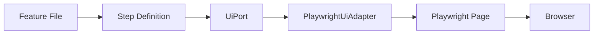

# UI Testing Guide

Comprehensive guide to browser-based UI testing with @kata/stack-tests.

## Overview

UI testing validates browser-based interfaces using Playwright. Use `@ui` tagged steps for user interaction testing.



## Navigation

### Basic Navigation

```gherkin
@ui
Scenario: Navigate to page
  Given I navigate to "/login"
  Then the URL should contain "/login"
```

### Full URL

```gherkin
@ui
Scenario: External navigation
  Given I open "https://example.com" in the browser
```

### Browser Actions

```gherkin
@ui
Scenario: Browser navigation
  Given I navigate to "/page1"
  When I click the link "Next"
  Then the URL should contain "/page2"
  When I go back in the browser
  Then the URL should contain "/page1"
  When I reload the page
```

## Interacting with Elements

### Clicking

```gherkin
@ui
Scenario: Click interactions
  # Click button by name
  When I click the button "Submit"
  
  # Click link by text
  When I click the link "Learn More"
```

### Advanced Clicking

```gherkin
@ui
Scenario: Click by locator
  # Click element containing text
  When I "click" the "div" element that contains "Click Me"
  
  # Click by test ID
  When I "click" the "1st" element with "submit-btn" "test ID"
  
  # Click by label
  When I "click" the "1st" element with "Username" "label"
  
  # Force click (bypasses visibility checks)
  When I "force click" the "1st" element with "hidden-btn" "test ID"
```

### Click Modes

| Mode | Description |
|------|-------------|
| `click` | Standard click |
| `force click` | Bypasses visibility checks |
| `dispatch click` | Dispatches click event |
| `force dispatch click` | Force + dispatch |

## Form Interactions

### Filling Fields

```gherkin
@ui
Scenario: Fill form fields
  # By label
  When I fill the field "Email" with "user@example.com"
  When I fill the field "Password" with "secret123"
  
  # By placeholder
  When I fill the placeholder "Enter your name" with "John Doe"
```

### Input Modes

```gherkin
@ui
Scenario: Different input methods
  # Type (character by character)
  When I "type" "hello" in the "1st" element with "search" "placeholder"
  
  # Fill (instant)
  When I "fill" "hello" in the "1st" element with "search" "placeholder"
  
  # Choose (dropdown)
  When I "choose" "Option A" in the "1st" element with "Select..." "placeholder"
```

### Dropdowns

```gherkin
@ui
Scenario: Select from dropdown
  Then I fill "United States" into the "Country" dropdown
  
  # Or using select step
  When I select from dropdown "Country" value "United States"
```

### Keyboard Input

```gherkin
@ui
Scenario: Keyboard actions
  # Type text
  Then I "type" "search query"
  
  # Press keys
  Then I "press" "Enter"
  Then I "press" "Tab"
  Then I "press" "Escape"
```

## Assertions

### Text Visibility

```gherkin
@ui
Scenario: Text assertions
  Then I should see text "Welcome"
  Then I should see text "Hello, {username}"
```

### URL Assertions

```gherkin
@ui
Scenario: URL assertions
  Then the URL should contain "/dashboard"
  Then I verify if the URL "contains" "/dashboard"
  Then I verify if the URL "equals" "http://localhost:3000/dashboard"
  Then I verify if the URL "doesntContain" "/login"
```

### Element Visibility

```gherkin
@ui
Scenario: Element visibility
  # Check element with text is visible
  Then I verify that a "button" element with "Submit" text "is" visible
  Then I verify that a "div" element with "Error" text "is not" visible
```

### Element State

```gherkin
@ui
Scenario: Element states
  # Immediate check
  Then I verify that "1st" element with "Submit" "text" is "visible"
  Then I verify that "1st" element with "Submit" "text" is "enabled"
  Then I verify that "1st" element with "Email" "label" is "editable"
  
  # With timeout
  Then I verify that "1st" element with "Submit" "text" becomes "visible" during "5" seconds
```

### Element States

| State | Description |
|-------|-------------|
| `visible` | Element is visible |
| `hidden` | Element is hidden |
| `enabled` | Element is enabled |
| `disabled` | Element is disabled |
| `editable` | Element is editable |
| `read-only` | Element is read-only |

### New Tab Assertions

```gherkin
@ui
Scenario: New tab opened
  When I click the link "Open in new tab"
  Then I verify if a new tab which URL "contains" "/new-page" opens
```

## Locator Methods

| Method | Description | Example |
|--------|-------------|---------|
| `text` | By visible text | `"Submit" "text"` |
| `label` | By label text | `"Email" "label"` |
| `placeholder` | By placeholder | `"Enter name" "placeholder"` |
| `role` | By ARIA role | `"button" "role"` |
| `test ID` | By data-testid | `"submit-btn" "test ID"` |
| `alternative text` | By alt text | `"Logo" "alternative text"` |
| `title` | By title attribute | `"Help" "title"` |
| `locator` | CSS/XPath selector | `"#submit" "locator"` |

## Waiting

### Explicit Waits

```gherkin
@ui
Scenario: Wait for conditions
  # Wait fixed time
  Then I wait "2" seconds
  
  # Wait for page load
  Then I wait for the page to load
```

### Implicit Waits

Most assertions automatically wait:

```gherkin
@ui
Scenario: Auto-waiting
  # Waits up to timeout for text to appear
  Then I should see text "Loading complete"
```

## URL and State Capture

### Save URL

```gherkin
@ui
Scenario: Capture URL
  When I save the current URL as "startPage"
  # Navigate around...
  Given I navigate to "{startPage}"
```

### Extract URL Parts

```gherkin
@ui
Scenario: Extract from URL
  # URL: /users/123/profile
  When I get a part of the URL based on "/users/(\d+)/" regular expression and save it as "userId"
  # userId = "123"
```

## Visual Testing

### Zoom

```gherkin
@ui
Scenario: Test at different zoom levels
  Then I zoom to "1.5" in the browser
  Then I should see text "Content visible at 150%"
  Then I zoom to "1" in the browser
```

## Authentication

### UI Login

```gherkin
@ui
Scenario: Login via UI
  When I log in as admin in UI
  Then the URL should contain "/dashboard"

@ui
Scenario: Login via UI as user
  When I log in as user in UI
  Then I should see text "Welcome"
```

## Complete Examples

### Login Flow

```gherkin
@ui
Feature: Login

  Scenario: Successful login
    Given I navigate to "/login"
    When I fill the field "Email" with "user@example.com"
    And I fill the field "Password" with "password123"
    And I click the button "Sign In"
    Then I should see text "Welcome"
    And the URL should contain "/dashboard"

  Scenario: Failed login
    Given I navigate to "/login"
    When I fill the field "Email" with "wrong@example.com"
    And I fill the field "Password" with "wrongpassword"
    And I click the button "Sign In"
    Then I should see text "Invalid credentials"
    And the URL should contain "/login"
```

### Form Submission

```gherkin
@ui
Feature: Contact Form

  Scenario: Submit contact form
    Given I navigate to "/contact"
    When I fill the field "Name" with "John Doe"
    And I fill the field "Email" with "john@example.com"
    And I fill the field "Message" with "Hello, this is a test message."
    And I fill "General Inquiry" into the "Subject" dropdown
    And I click the button "Send Message"
    Then I should see text "Thank you for your message"
```

### Multi-Step Wizard

```gherkin
@ui
Feature: Registration Wizard

  Scenario: Complete registration
    Given I navigate to "/register"
    
    # Step 1: Account
    When I fill the field "Email" with "new@example.com"
    And I fill the field "Password" with "SecurePass123"
    And I click the button "Next"
    
    # Step 2: Profile
    Then I should see text "Profile Information"
    When I fill the field "First Name" with "John"
    And I fill the field "Last Name" with "Doe"
    And I click the button "Next"
    
    # Step 3: Confirmation
    Then I should see text "Review"
    And I should see text "new@example.com"
    When I click the button "Complete Registration"
    Then I should see text "Registration successful"
```

### Conditional Interactions

```gherkin
@ui
Scenario: Handle optional modal
  Given I navigate to "/dashboard"
  # Click if visible, ignore if not
  When If its visible, I "click" the "1st" element with "Dismiss" "text"
  Then I should see text "Dashboard"
```

## Environment Configuration

```bash
# .env
FRONTEND_URL=http://localhost:3000
HEADLESS=true
```

## Best Practices

### Use Semantic Locators

```gherkin
# Good - semantic
When I click the button "Submit"
When I fill the field "Email" with "user@example.com"

# Avoid - implementation-specific
When I "click" the "1st" element with "#btn-submit" "locator"
```

### Independent Scenarios

```gherkin
# Good - self-contained
@ui
Scenario: Edit profile
  Given I navigate to "/login"
  When I log in as user in UI
  And I navigate to "/profile"
  And I fill the field "Name" with "Updated Name"
  And I click the button "Save"
  Then I should see text "Profile updated"
```

### Appropriate Waits

```gherkin
# Good - wait for specific condition
Then I should see text "Data loaded"

# Avoid - arbitrary delays
Then I wait "5" seconds
Then I should see text "Data loaded"
```

### Test IDs for Complex Elements

```html
<!-- In your application -->
<button data-testid="submit-form">Submit</button>
```

```gherkin
When I "click" the "1st" element with "submit-form" "test ID"
```

## Debugging

### Visual Debugging

```bash
# Run with headed browser
HEADLESS=false npm test

# Use Playwright UI mode
npx playwright test --ui

# Debug mode
npx playwright test --debug
```

### Trace Viewer

```typescript
// playwright.config.ts
use: {
  trace: 'on-first-retry',
}
```

```bash
npx playwright show-trace trace.zip
```

## Related Topics

- [UI Steps Reference](../reference/steps/ui-steps.md) - Complete step reference
- [Hybrid Testing](./hybrid-testing.md) - Combine with API tests
- [CI/CD Integration](./ci-cd.md) - Running in pipelines
