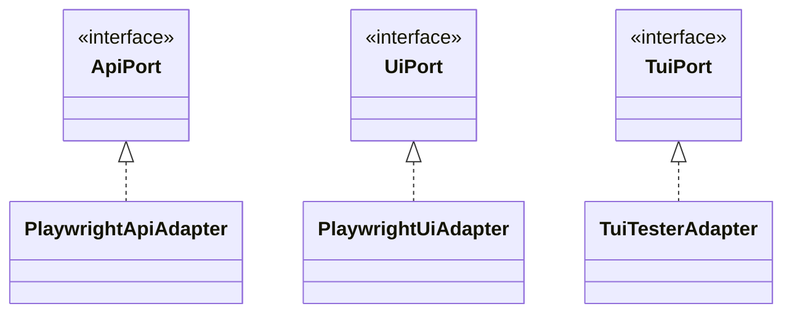

# Adapters Reference

Complete reference for all adapter implementations in @kata/stack-tests.

## Overview

Adapters implement port interfaces using specific technologies.



## PlaywrightApiAdapter

HTTP API adapter using Playwright's request context.

### Import

```typescript
import { PlaywrightApiAdapter } from '@kata/stack-tests';
```

### Constructor

```typescript
new PlaywrightApiAdapter(request: APIRequestContext)
```

| Parameter | Type | Description |
|-----------|------|-------------|
| `request` | `APIRequestContext` | Playwright's API request context |

### Usage

```typescript
import { createBddTest, PlaywrightApiAdapter } from '@kata/stack-tests';

const test = createBddTest({
  createApi: ({ apiRequest }) => new PlaywrightApiAdapter(apiRequest),
});
```

### Features

- Automatic JSON serialization/parsing
- Form URL encoding support
- Response header extraction
- Content-type detection

---

## PlaywrightUiAdapter

Browser UI adapter using Playwright's Page.

### Import

```typescript
import { PlaywrightUiAdapter } from '@kata/stack-tests';
```

### Constructor

```typescript
new PlaywrightUiAdapter(page: Page)
```

| Parameter | Type | Description |
|-----------|------|-------------|
| `page` | `Page` | Playwright Page instance |

### Usage

```typescript
import { createBddTest, PlaywrightUiAdapter } from '@kata/stack-tests';

const test = createBddTest({
  createUi: ({ page }) => new PlaywrightUiAdapter(page),
});
```

### Features

- Semantic locators (role, label, text, placeholder)
- Multiple click modes (click, force click, dispatch)
- Auto-waiting for elements
- URL assertion support
- Multi-tab handling

### Locator Methods

| Method | Playwright API |
|--------|---------------|
| `text` | `getByText()` |
| `label` | `getByLabel()` |
| `placeholder` | `getByPlaceholder()` |
| `role` | `getByRole()` |
| `test ID` | `getByTestId()` |
| `alternative text` | `getByAltText()` |
| `title` | `getByTitle()` |
| `locator` | `locator()` |

---

## TuiTesterAdapter

Terminal UI adapter using tui-tester library.

### Import

```typescript
import { TuiTesterAdapter } from '@kata/stack-tests';
```

### Constructor

```typescript
new TuiTesterAdapter(config: TuiConfig)
```

### Configuration

```typescript
type TuiConfig = {
  command: string[];           // Command to run (e.g., ['node', 'cli.js'])
  size?: {                     // Terminal size
    cols: number;              // Default: 80
    rows: number;              // Default: 24
  };
  cwd?: string;                // Working directory
  env?: Record<string, string>; // Environment variables
  debug?: boolean;             // Debug output
  snapshotDir?: string;        // Snapshot directory
  shell?: string;              // Shell to use
};
```

### Usage

```typescript
import { createBddTest, TuiTesterAdapter } from '@kata/stack-tests';

const test = createBddTest({
  createTui: () => new TuiTesterAdapter({
    command: ['node', 'dist/cli.js'],
    size: { cols: 100, rows: 30 },
    debug: process.env.DEBUG === 'true',
  }),
});
```

### Features

- tmux-based terminal emulation
- Keyboard and mouse input
- Screen capture and snapshots
- Pattern matching assertions
- Lazy loading (tui-tester only loaded when used)

### Requirements

- tmux installed on system
- tui-tester npm package (optional peer dependency)

---

## UniversalAuthAdapter

Authentication adapter supporting both API and UI login.

### Import

```typescript
import { UniversalAuthAdapter } from '@kata/stack-tests';
```

### Constructor

```typescript
new UniversalAuthAdapter(deps: { api: ApiPort; ui: UiPort })
```

| Parameter | Type | Description |
|-----------|------|-------------|
| `deps.api` | `ApiPort` | API adapter for token-based auth |
| `deps.ui` | `UiPort` | UI adapter for form-based auth |

### Usage

```typescript
import { createBddTest, UniversalAuthAdapter } from '@kata/stack-tests';

const test = createBddTest({
  createAuth: ({ api, ui }) => new UniversalAuthAdapter({ api, ui }),
});
```

### Environment Variables

| Variable | Default | Description |
|----------|---------|-------------|
| `DEFAULT_ADMIN_USERNAME` | `'admin@prima.com'` | Admin email/username |
| `DEFAULT_ADMIN_PASSWORD` | `'admin1234'` | Admin password |
| `DEFAULT_USER_USERNAME` | `'bob@bob.com'` | User email/username |
| `DEFAULT_USER_PASSWORD` | `'bob1234'` | User password |
| `API_AUTH_LOGIN_PATH` | `'/auth/login'` | Login endpoint |

### API Login Flow

1. POST to login endpoint with credentials
2. Extract `access_token` from response
3. Set `Authorization: Bearer <token>` in world.headers

### UI Login Flow

1. Navigate to `/login`
2. Fill email and password fields
3. Click sign-in button

---

## DefaultCleanupAdapter

Resource cleanup adapter with rule-based cleanup registration.

### Import

```typescript
import { DefaultCleanupAdapter } from '@kata/stack-tests';
```

### Constructor

```typescript
new DefaultCleanupAdapter(options?: {
  rules?: CleanupRule[];
  allowHeuristic?: boolean;
})
```

### Configuration

```typescript
type CleanupRule = {
  varMatch: string;            // Pattern to match variable name
  method?: 'DELETE' | 'POST' | 'PATCH' | 'PUT';  // Default: DELETE
  path: string;                // Cleanup path with {id} placeholder
};
```

### Usage

```typescript
import { createBddTest, DefaultCleanupAdapter } from '@kata/stack-tests';

// With default rules
const test = createBddTest({
  createCleanup: () => new DefaultCleanupAdapter(),
});

// With custom rules
const test = createBddTest({
  createCleanup: () => new DefaultCleanupAdapter({
    rules: [
      { varMatch: 'user', path: '/api/users/{id}' },
      { varMatch: 'order', path: '/api/orders/{id}' },
    ],
    allowHeuristic: false,
  }),
});
```

### Default Rules

| Variable Pattern | Cleanup Path |
|-----------------|--------------|
| `tool_provider` | `/admin/tool/providers/{id}` |
| `extsvc`, `external_service` | `/admin/tool/external-services/{id}` |
| `workspace` | `/admin/workspaces/{id}` |
| `team` | `/admin/teams/{id}` |
| `prima_model`, `pm` | `/admin/llm/prima-models/{id}` |
| `cred` | `/admin/llm/provider-credentials/{id}` |
| `user`, `manager`, `member`, `creator` | `/admin/users/{id}` |
| `rule` | `/admin/llm/guardrail-rules/{id}` |

### Heuristic Cleanup

When `allowHeuristic: true` (or `CLEANUP_ALLOW_ALL=true`), cleanup is registered for any variable with:
- Name containing `__` (double underscore)
- Name containing `test` (case-insensitive)
- Name matching `run[0-9a-f]+` pattern

### Environment Variables

| Variable | Default | Description |
|----------|---------|-------------|
| `CLEANUP_RULES` | - | JSON array of custom rules |
| `CLEANUP_ALLOW_ALL` | `'false'` | Enable heuristic cleanup |

---

## Creating Custom Adapters

### Implement a Port Interface

```typescript
import type { ApiPort, ApiResult, ApiMethod } from '@kata/stack-tests';

export class CustomApiAdapter implements ApiPort {
  async sendJson(
    method: ApiMethod,
    path: string,
    body?: unknown,
    headers?: Record<string, string>
  ): Promise<ApiResult> {
    // Your implementation
  }

  async sendForm(
    method: 'POST' | 'PUT' | 'PATCH',
    path: string,
    form: Record<string, string>,
    headers?: Record<string, string>
  ): Promise<ApiResult> {
    // Your implementation
  }
}
```

### Register Custom Adapter

```typescript
const test = createBddTest({
  createApi: () => new CustomApiAdapter(),
});
```

---

## Related Topics

- [Ports Reference](./ports.md) - Port interfaces
- [Custom Adapters Guide](../../guides/custom-adapters.md) - Creating adapters
- [Architecture](../../concepts/architecture.md) - Design patterns
