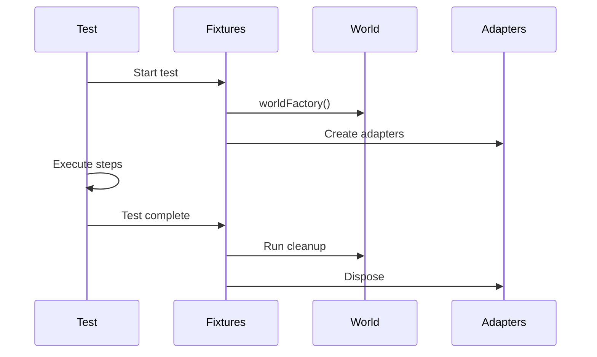

# Fixtures Reference

Complete reference for the `createBddTest` function and fixture system.

## Overview

`createBddTest` is the main factory function that creates a configured BDD test instance with dependency-injected adapters.

## createBddTest

### Import

```typescript
import { createBddTest, type CreateBddTestOptions } from '@kata/stack-tests';
```

### Signature

```typescript
function createBddTest(options?: CreateBddTestOptions): BddTest
```

### Options

```typescript
type CreateBddTestOptions = {
  createApi?: (ctx: CreateContext) => ApiPort;
  createUi?: (ctx: CreateContext) => UiPort;
  createAuth?: (ctx: CreateContext & { api: ApiPort; ui: UiPort }) => AuthPort;
  createCleanup?: (ctx: CreateContext) => CleanupPort;
  createTui?: () => TuiPort | undefined;
  worldFactory?: () => World;
};

type CreateContext = PlaywrightTestArgs & PlaywrightWorkerArgs & {
  apiRequest: APIRequestContext;
  page: Page;
};
```

### Default Behavior

When options are not provided, defaults are used:

| Option | Default |
|--------|---------|
| `createApi` | `PlaywrightApiAdapter` |
| `createUi` | `PlaywrightUiAdapter` |
| `createAuth` | `UniversalAuthAdapter` |
| `createCleanup` | `DefaultCleanupAdapter` |
| `createTui` | `undefined` (disabled) |
| `worldFactory` | `initWorld()` |

### Usage Examples

#### Minimal (All Defaults)

```typescript
import { createBddTest } from '@kata/stack-tests';

export const test = createBddTest();
```

#### Custom API Adapter

```typescript
import { createBddTest, PlaywrightApiAdapter } from '@kata/stack-tests';

export const test = createBddTest({
  createApi: ({ apiRequest }) => {
    // Add custom logic, logging, etc.
    return new PlaywrightApiAdapter(apiRequest);
  },
});
```

#### With TUI Support

```typescript
import { createBddTest, TuiTesterAdapter } from '@kata/stack-tests';

export const test = createBddTest({
  createTui: () => new TuiTesterAdapter({
    command: ['node', 'dist/cli.js'],
    size: { cols: 100, rows: 30 },
  }),
});
```

#### Custom Cleanup Rules

```typescript
import { createBddTest, DefaultCleanupAdapter } from '@kata/stack-tests';

export const test = createBddTest({
  createCleanup: () => new DefaultCleanupAdapter({
    rules: [
      { varMatch: 'customer', path: '/api/customers/{id}' },
      { varMatch: 'order', path: '/api/orders/{id}' },
    ],
  }),
});
```

#### Extended World

```typescript
import { createBddTest, initWorld, type World } from '@kata/stack-tests';

interface MyWorld extends World {
  currentUser?: { id: string; email: string };
}

function initMyWorld(): MyWorld {
  return {
    ...initWorld(),
    currentUser: undefined,
  };
}

export const test = createBddTest({
  worldFactory: initMyWorld,
});
```

## Available Fixtures

### world

The test state container.

```typescript
test('example', async ({ world }) => {
  world.vars['key'] = 'value';
  world.headers['Authorization'] = 'Bearer token';
});
```

### api

The API adapter for HTTP operations.

```typescript
test('example', async ({ api, world }) => {
  const result = await api.sendJson('GET', '/users', undefined, world.headers);
});
```

### ui

The UI adapter for browser operations.

```typescript
test('example', async ({ ui }) => {
  await ui.goto('/login');
  await ui.fillLabel('Email', 'user@example.com');
});
```

### auth

The authentication adapter.

```typescript
test('example', async ({ auth, world }) => {
  await auth.apiLoginAsAdmin(world);
});
```

### cleanup

The cleanup adapter.

```typescript
test('example', async ({ cleanup, world }) => {
  cleanup.registerFromVar(world, 'userId', '123');
});
```

### tui

The TUI adapter (if configured).

```typescript
test('example', async ({ tui }) => {
  if (tui) {
    await tui.start();
    await tui.typeText('hello');
  }
});
```

### apiRequest

The raw Playwright API request context.

```typescript
test('example', async ({ apiRequest }) => {
  const response = await apiRequest.get('/health');
});
```

## Fixture Lifecycle



### Initialization Order

1. `apiRequest` - Playwright request context
2. `api` - API adapter
3. `cleanup` - Cleanup adapter
4. `ui` - UI adapter (requires page)
5. `auth` - Auth adapter (requires api and ui)
6. `world` - World state
7. `tui` - TUI adapter (independent)

### Cleanup Order

After test completion:

1. World cleanup items executed (reverse order)
2. TUI stopped (if running)
3. Resources disposed

## baseTest

Re-exported base test from playwright-bdd for advanced use cases.

```typescript
import { baseTest } from '@kata/stack-tests';

// Extend with custom fixtures
const customTest = baseTest.extend({
  myFixture: async ({}, use) => {
    await use('value');
  },
});
```

## Type Exports

```typescript
import type {
  CreateBddTestOptions,
  TuiFactory,
  TuiConfig,
} from '@kata/stack-tests';
```

### TuiFactory

```typescript
type TuiFactory = () => TuiPort | undefined;
```

### TuiConfig

```typescript
type TuiConfig = {
  command: string[];
  size?: { cols: number; rows: number };
  cwd?: string;
  env?: Record<string, string>;
  debug?: boolean;
  snapshotDir?: string;
  shell?: string;
};
```

## Integration with playwright-bdd

### Step Registration

```typescript
import { createBdd } from 'playwright-bdd';
import { test } from './fixtures';

const { Given, When, Then } = createBdd(test);

Given('a precondition', async ({ world }) => {
  // Access fixtures
});
```

### Project Configuration

```typescript
import { defineBddProject } from 'playwright-bdd';

const project = defineBddProject({
  name: 'api',
  features: 'features/api/**/*.feature',
  steps: 'features/steps/**/*.ts',
  tags: '@api',
});
```

---

## Related Topics

- [Project Setup](../../getting-started/project-setup.md) - Configuration
- [World State](../../concepts/world-state.md) - World management
- [Test Lifecycle](../../concepts/test-lifecycle.md) - Fixture flow
