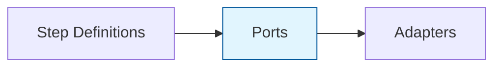

# Ports Reference

Complete reference for all port interfaces in @kata/stack-tests.

## Overview

Ports define the contracts that adapters must implement. They enable the Ports and Adapters (Hexagonal) architecture pattern.



## ApiPort

HTTP API operations interface.

### Import

```typescript
import type { ApiPort, ApiMethod, ApiResult } from '@kata/stack-tests';
```

### Interface

```typescript
interface ApiPort {
  sendJson(
    method: ApiMethod,
    path: string,
    body?: unknown,
    headers?: Record<string, string>
  ): Promise<ApiResult>;

  sendForm(
    method: 'POST' | 'PUT' | 'PATCH',
    path: string,
    form: Record<string, string>,
    headers?: Record<string, string>
  ): Promise<ApiResult>;
}
```

### Types

```typescript
type ApiMethod = 'GET' | 'POST' | 'PATCH' | 'PUT' | 'DELETE';

type ApiResult = {
  status: number;
  text: string;
  json?: unknown;
  headers: Record<string, string>;
  contentType?: string;
  response: APIResponse;  // Playwright APIResponse
};
```

### Methods

#### `sendJson(method, path, body?, headers?)`

Sends an HTTP request with JSON body.

| Parameter | Type | Required | Description |
|-----------|------|----------|-------------|
| `method` | `ApiMethod` | Yes | HTTP method |
| `path` | `string` | Yes | Request path (appended to base URL) |
| `body` | `unknown` | No | Request body (serialized to JSON) |
| `headers` | `Record<string, string>` | No | Additional headers |

**Returns:** `Promise<ApiResult>`

**Example:**
```typescript
const result = await api.sendJson('POST', '/users', {
  email: 'test@example.com',
  name: 'Test User',
}, {
  'X-Request-ID': '123',
});

console.log(result.status);  // 201
console.log(result.json);    // { id: '...', email: '...' }
```

#### `sendForm(method, path, form, headers?)`

Sends an HTTP request with form-urlencoded body.

| Parameter | Type | Required | Description |
|-----------|------|----------|-------------|
| `method` | `'POST' \| 'PUT' \| 'PATCH'` | Yes | HTTP method |
| `path` | `string` | Yes | Request path |
| `form` | `Record<string, string>` | Yes | Form fields |
| `headers` | `Record<string, string>` | No | Additional headers |

**Returns:** `Promise<ApiResult>`

**Example:**
```typescript
const result = await api.sendForm('POST', '/auth/login', {
  username: 'admin@example.com',
  password: 'secret',
});
```

---

## UiPort

Browser UI operations interface.

### Import

```typescript
import type { 
  UiPort, 
  UiClickMode, 
  UiInputMode, 
  UiUrlAssertMode, 
  UiLocatorMethod, 
  UiElementState 
} from '@kata/stack-tests';
```

### Interface

```typescript
interface UiPort {
  // Navigation
  goto(path: string): Promise<void>;
  goBack(): Promise<void>;
  reload(): Promise<void>;
  getCurrentUrl(): Promise<string>;
  waitForPageLoad(): Promise<void>;

  // Basic Interactions
  clickButton(name: string): Promise<void>;
  clickLink(name: string): Promise<void>;
  fillPlaceholder(placeholder: string, value: string): Promise<void>;
  fillLabel(label: string, value: string): Promise<void>;

  // Advanced Interactions
  clickElementThatContains(clickMode: UiClickMode, elementType: string, text: string): Promise<void>;
  clickElementWith(clickMode: UiClickMode, ordinal: string, text: string, method: UiLocatorMethod): Promise<void>;
  fillDropdown(value: string, dropdownLabel: string): Promise<void>;
  inputInElement(action: UiInputMode, value: string, ordinal: string, text: string, method: UiLocatorMethod): Promise<void>;

  // Keyboard
  typeText(text: string): Promise<void>;
  pressKey(key: string): Promise<void>;

  // Waiting
  waitSeconds(seconds: number): Promise<void>;

  // Viewport
  zoomTo(scale: number): Promise<void>;

  // Assertions
  expectText(text: string): Promise<void>;
  expectUrlContains(part: string): Promise<void>;
  expectUrl(mode: UiUrlAssertMode, expected: string): Promise<void>;
  expectNewTabUrl(mode: UiUrlAssertMode, expected: string): Promise<void>;
  expectElementWithTextVisible(elementType: string, text: string, shouldBeVisible: boolean): Promise<void>;
  expectElementState(ordinal: string, text: string, method: UiLocatorMethod, state: UiElementState): Promise<void>;
  expectElementStateWithin(ordinal: string, text: string, method: UiLocatorMethod, state: UiElementState, seconds: number): Promise<void>;
}
```

### Types

```typescript
type UiClickMode = 'click' | 'dispatch click' | 'force click' | 'force dispatch click';
type UiInputMode = 'type' | 'fill' | 'choose';
type UiUrlAssertMode = 'contains' | 'doesntContain' | 'equals';
type UiLocatorMethod = 'text' | 'label' | 'placeholder' | 'role' | 'test ID' | 'alternative text' | 'title' | 'locator';
type UiElementState = 'visible' | 'hidden' | 'editable' | 'disabled' | 'enabled' | 'read-only';
```

### Key Methods

#### `goto(path)`

Navigates to a URL path.

```typescript
await ui.goto('/login');
await ui.goto('https://example.com');
```

#### `clickButton(name)`

Clicks a button by its accessible name.

```typescript
await ui.clickButton('Submit');
await ui.clickButton('Sign In');
```

#### `fillLabel(label, value)`

Fills an input field by its label.

```typescript
await ui.fillLabel('Email', 'user@example.com');
await ui.fillLabel('Password', 'secret123');
```

#### `expectText(text)`

Asserts that text is visible on the page.

```typescript
await ui.expectText('Welcome');
await ui.expectText('Login successful');
```

---

## TuiPort

Terminal UI operations interface.

### Import

```typescript
import type {
  TuiPort,
  TuiConfig,
  TuiKeyModifiers,
  TuiWaitOptions,
  TuiScreenCapture,
  TuiSnapshotResult,
  TuiMouseEvent,
  TuiMouseButton,
} from '@kata/stack-tests';
```

### Interface

```typescript
interface TuiPort {
  // Lifecycle
  start(): Promise<void>;
  stop(): Promise<void>;
  restart(): Promise<void>;
  isRunning(): boolean;

  // Input
  typeText(text: string, options?: { delay?: number }): Promise<void>;
  pressKey(key: string, modifiers?: TuiKeyModifiers): Promise<void>;
  sendText(text: string): Promise<void>;
  fillField(fieldLabel: string, value: string): Promise<void>;
  selectOption(option: string): Promise<void>;

  // Mouse
  sendMouse(event: TuiMouseEvent): Promise<void>;
  click(x: number, y: number, button?: TuiMouseButton): Promise<void>;
  clickOnText(text: string): Promise<void>;

  // Assertions
  expectText(text: string, options?: TuiWaitOptions): Promise<void>;
  expectPattern(pattern: RegExp, options?: TuiWaitOptions): Promise<void>;
  expectNotText(text: string): Promise<void>;
  assertScreenContains(text: string): Promise<void>;
  assertScreenMatches(pattern: RegExp): Promise<void>;

  // Waiting
  waitForText(text: string, options?: TuiWaitOptions): Promise<void>;
  waitForPattern(pattern: RegExp, options?: TuiWaitOptions): Promise<void>;
  waitForReady(): Promise<void>;
  waitSeconds(seconds: number): Promise<void>;

  // Screen Capture
  captureScreen(): Promise<TuiScreenCapture>;
  getScreenText(): Promise<string>;
  getScreenLines(): Promise<string[]>;

  // Snapshots
  takeSnapshot(name: string): Promise<void>;
  matchSnapshot(name: string): Promise<TuiSnapshotResult>;

  // Utility
  clear(): Promise<void>;
  resize(size: { cols: number; rows: number }): Promise<void>;
  getSize(): { cols: number; rows: number };
  getConfig(): TuiConfig;
}
```

### Types

```typescript
type TuiConfig = {
  command: string[];
  size?: { cols: number; rows: number };
  cwd?: string;
  env?: Record<string, string>;
  debug?: boolean;
  snapshotDir?: string;
  shell?: string;
};

type TuiKeyModifiers = {
  ctrl?: boolean;
  alt?: boolean;
  shift?: boolean;
  meta?: boolean;
};

type TuiWaitOptions = {
  timeout?: number;
  interval?: number;
};

type TuiScreenCapture = {
  text: string;
  lines: string[];
  timestamp: number;
  size: { cols: number; rows: number };
};

type TuiSnapshotResult = {
  pass: boolean;
  diff?: string;
  snapshotPath?: string;
};

type TuiMouseButton = 'left' | 'right' | 'middle';
type TuiMouseEventType = 'click' | 'down' | 'up' | 'drag' | 'scroll';

type TuiMouseEvent = {
  type: TuiMouseEventType;
  position: { x: number; y: number };
  button?: TuiMouseButton;
};
```

---

## AuthPort

Authentication operations interface.

### Import

```typescript
import type { AuthPort } from '@kata/stack-tests';
```

### Interface

```typescript
interface AuthPort {
  apiLoginAsAdmin(world: World): Promise<void>;
  apiLoginAsUser(world: World): Promise<void>;
  apiSetBearer(world: World, token: string): void;
  uiLoginAsAdmin(world: World): Promise<void>;
  uiLoginAsUser(world: World): Promise<void>;
}
```

### Methods

#### `apiLoginAsAdmin(world)`

Authenticates as admin via API, setting bearer token in world.headers.

#### `apiLoginAsUser(world)`

Authenticates as standard user via API.

#### `apiSetBearer(world, token)`

Manually sets a bearer token.

#### `uiLoginAsAdmin(world)`

Performs admin login through the UI.

#### `uiLoginAsUser(world)`

Performs user login through the UI.

---

## CleanupPort

Resource cleanup interface.

### Import

```typescript
import type { CleanupPort } from '@kata/stack-tests';
```

### Interface

```typescript
interface CleanupPort {
  registerFromVar(world: World, varName: string, id: unknown, meta?: unknown): void;
}
```

### Methods

#### `registerFromVar(world, varName, id, meta?)`

Registers a resource for cleanup based on variable naming conventions.

| Parameter | Type | Required | Description |
|-----------|------|----------|-------------|
| `world` | `World` | Yes | Test world state |
| `varName` | `string` | Yes | Variable name (used to determine cleanup path) |
| `id` | `unknown` | Yes | Resource ID |
| `meta` | `unknown` | No | Additional metadata |

**Example:**
```typescript
cleanup.registerFromVar(world, 'userId', '123');
// Registers DELETE /admin/users/123 based on 'user' pattern
```

---

## Related Topics

- [Adapters Reference](./adapters.md) - Adapter implementations
- [Architecture](../../concepts/architecture.md) - Ports and adapters pattern
- [Custom Adapters Guide](../../guides/custom-adapters.md) - Creating adapters
